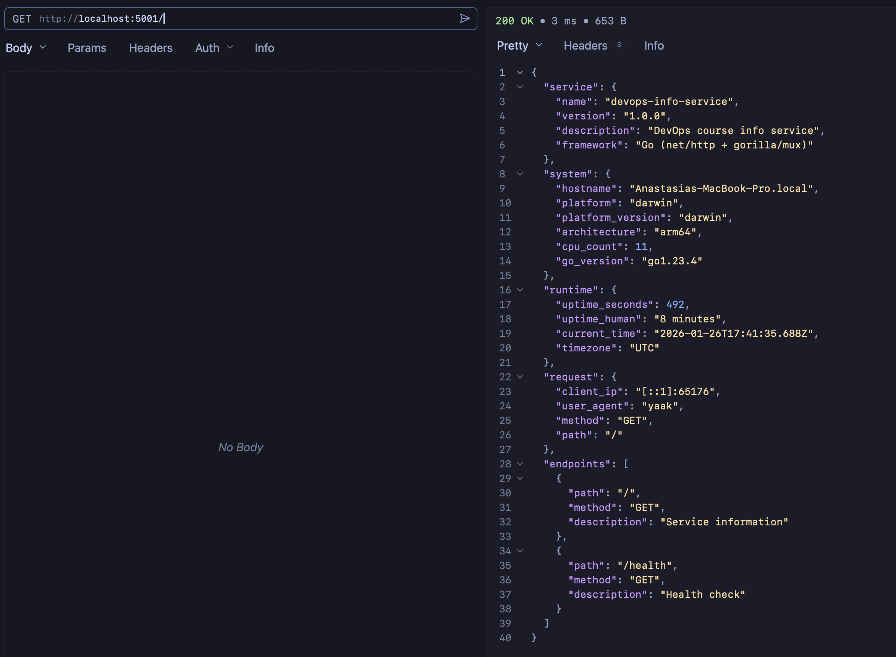
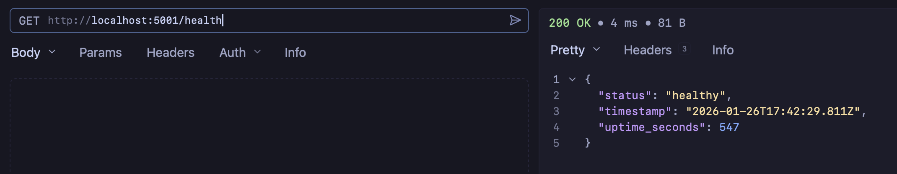
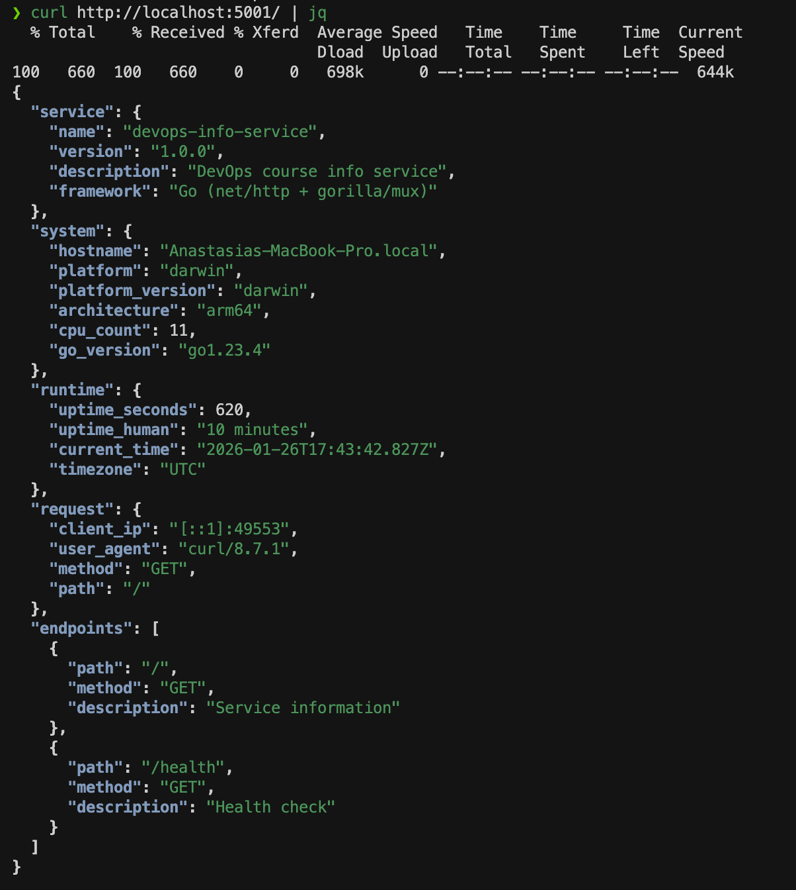

# Lab 01 - Go Implementation Documentation

## Implementation Overview

This document describes the Go implementation of the DevOps Info Service.

## Framework Selection

### Choice: Go with net/http + gorilla/mux

**Rationale:**
- **net/http**: Go's standard library HTTP package provides a complete HTTP server implementation
- **gorilla/mux**: Lightweight router for clean URL routing and middleware support
- **No heavy framework**: Avoids framework bloat while maintaining flexibility
- **Production-ready**: Used by many production services

### Alternative Considered: Pure net/http

While Go's `net/http` alone is sufficient, `gorilla/mux` was chosen for:
- Better URL pattern matching
- Cleaner route organization
- Built-in middleware support
- Industry standard for Go web services

## Implementation Details

### Project Structure

```
app_go/
├── main.go              # Main application (400+ lines)
├── go.mod               # Go module definition
├── go.sum               # Dependency checksums
├── README.md            # User documentation
├── .gitignore           # Git ignore rules
└── docs/
    ├── LAB01.md         # This file
    ├── GO.md            # Language justification
    └── screenshots/     # Proof of work
```

### Code Organization

The application follows Go best practices:

1. **Package Structure**
   - Single `main` package
   - Clear separation of concerns with helper functions
   - Type definitions at package level

2. **Type Definitions**
   ```go
   type ServiceInfo struct {
       Service  Service     `json:"service"`
       System   System      `json:"system"`
       Runtime  Runtime     `json:"runtime"`
       Request  RequestInfo `json:"request"`
       Endpoints []Endpoint `json:"endpoints"`
   }
   ```
   - Struct tags for JSON serialization
   - Clear, descriptive names

3. **Error Handling**
   - Custom 404 handler
   - Custom 405 (Method Not Allowed) handler
   - Proper HTTP status codes
   - JSON error responses

4. **Configuration**
   - Environment variable support
   - Sensible defaults
   - No hardcoded values

### Key Features Implemented

#### 1. Main Endpoint (`GET /`)

Returns comprehensive service information matching the Python version's JSON structure:

- **Service metadata**: Name, version, description, framework
- **System information**: Hostname, platform, architecture, CPU count, Go version
- **Runtime information**: Uptime (seconds and human-readable), current time, timezone
- **Request information**: Client IP, user agent, method, path
- **Endpoints list**: Available API endpoints

**Implementation highlights:**
- Client IP extraction with proxy header support (X-Forwarded-For, X-Real-IP)
- Human-readable uptime formatting
- RFC3339 timestamp formatting with UTC timezone
- JSON encoding with proper content-type headers

#### 2. Health Check Endpoint (`GET /health`)

Simple health check for monitoring:

- Status: "healthy"
- Timestamp: Current UTC time
- Uptime: Seconds since service start

**Use case:** Kubernetes liveness and readiness probes (Lab 9).

#### 3. Error Handling

Custom error handlers for:
- **404 Not Found**: Returns JSON error response
- **405 Method Not Allowed**: Returns JSON error response with method information

#### 4. Graceful Shutdown

Implements graceful shutdown on SIGTERM/SIGINT:
- Listens for termination signals
- Shuts down HTTP server gracefully
- Allows in-flight requests to complete

#### 5. Request Logging

Logs important events:
- Server startup with address and timestamp
- Request information (for debugging)

### Best Practices Applied

#### 1. Clean Code Organization

- Clear function names (`mainHandler`, `healthHandler`, `getSystemInfo`)
- Proper imports grouping (standard library, then third-party)
- Comments only where needed
- Follows Go naming conventions

#### 2. Error Handling

```go
func notFoundHandler(w http.ResponseWriter, r *http.Request) {
    w.Header().Set("Content-Type", "application/json")
    w.WriteHeader(http.StatusNotFound)
    json.NewEncoder(w).Encode(map[string]interface{}{
        "error":   "Not Found",
        "message": "Endpoint does not exist",
        "path":    r.URL.Path,
    })
}
```

#### 3. Logging

```go
log.Printf("Starting DevOps Info Service on %s", address)
log.Printf("Service started at %s", startTime.Format(time.RFC3339))
```

#### 4. Configuration

```go
host := os.Getenv("HOST")
if host == "" {
    host = "0.0.0.0"
}

port := os.Getenv("PORT")
if port == "" {
    port = "5000"
}
```

#### 5. Dependencies

Minimal dependencies:
- `github.com/gorilla/mux v1.8.1` - HTTP router

All other functionality uses Go standard library.

## API Documentation

### GET /

**Description:** Returns comprehensive service and system information.

**Request:**
```bash
curl http://localhost:5000/
```

**Response:**
```json
{
  "service": {
    "name": "devops-info-service",
    "version": "1.0.0",
    "description": "DevOps course info service",
    "framework": "Go (net/http + gorilla/mux)"
  },
  "system": {
    "hostname": "Anastasias-MacBook-Pro.local",
    "platform": "darwin",
    "platform_version": "darwin",
    "architecture": "arm64",
    "cpu_count": 11,
    "go_version": "go1.23.4"
  },
  "runtime": {
    "uptime_seconds": 303,
    "uptime_human": "5 minutes",
    "current_time": "2026-01-26T17:38:26.195Z",
    "timezone": "UTC"
  },
  "request": {
    "client_ip": "[::1]:64027",
    "user_agent": "yaak",
    "method": "GET",
    "path": "/"
  },
  "endpoints": [
    {
      "path": "/",
      "method": "GET",
      "description": "Service information"
    },
    {
      "path": "/health",
      "method": "GET",
      "description": "Health check"
    }
  ]
}
```

### GET /health

**Description:** Health check endpoint for monitoring.

**Request:**
```bash
curl http://localhost:5000/health
```

**Response:**
```json
{
  "status": "healthy",
  "timestamp": "2026-01-26T17:38:52.412Z",
  "uptime_seconds": 329
}
```

## Build Process

### Development Build

```bash
go build -o devops-info-service main.go
```

### Optimized Production Build

```bash
go build -ldflags="-s -w" -o devops-info-service main.go
```

**Flags:**
- `-s`: Omit symbol table and debug information
- `-w`: Omit DWARF symbol table

### Cross-Platform Build

```bash
# Linux
GOOS=linux GOARCH=amd64 go build -o devops-info-service-linux main.go

# macOS
GOOS=darwin GOARCH=amd64 go build -o devops-info-service-macos main.go

# Windows
GOOS=windows GOARCH=amd64 go build -o devops-info-service.exe main.go
```

## Binary Size Comparison

### Go Binary

**Size:** 7.8 MB (optimized)

### Python Comparison

Python application requires:
- Python runtime: ~50-100 MB
- Dependencies (FastAPI, uvicorn): ~20-30 MB
- Application code: ~1 MB

**Total:** ~70-130 MB (not including OS dependencies)

### Advantages of Go Binary

1. **Single file**: Just copy and run
2. **No runtime**: No Python interpreter needed
3. **Smaller containers**: Smaller Docker images
4. **Faster startup**: No interpreter initialization
5. **Cross-platform**: One binary per platform

## Testing Evidence

### Building the Application

```bash
$ cd app_go
$ go mod download
$ go build -o devops-info-service main.go
```

### Running the Service

```bash
$ ./devops-info-service
2026/01/26 20:33:22 Starting DevOps Info Service on 0.0.0.0:5001
2026/01/26 20:33:22 Service started at 2026-01-26T20:33:22+03:00
```

### Testing Endpoints

**Main Endpoint:**



**Health Check:**



**Formatted Output:**


### Custom Configuration

```bash
$ PORT=8080 ./devops-info-service
2026/01/26 14:30:00 Starting DevOps Info Service on 0.0.0.0:8080
```

## Challenges & Solutions

### Challenge 1: Client IP Extraction

**Problem:** Need to extract real client IP, handling proxies and load balancers.

**Solution:** Implemented multi-level IP extraction:
1. Check `X-Forwarded-For` header (for proxies)
2. Check `X-Real-IP` header (for nginx/load balancers)
3. Fall back to `RemoteAddr` (direct connection)

```go
func getClientIP(r *http.Request) string {
    if forwarded := r.Header.Get("X-Forwarded-For"); forwarded != "" {
        return forwarded
    }
    if realIP := r.Header.Get("X-Real-IP"); realIP != "" {
        return realIP
    }
    // Fall back to RemoteAddr
    ip := r.RemoteAddr
    // Remove port if present
    if colon := len(ip) - 1; colon >= 0 && ip[colon] == ':' {
        ip = ip[:colon]
    }
    return ip
}
```

### Challenge 2: Graceful Shutdown

**Problem:** Ensure server shuts down gracefully on termination signals.

**Solution:** Implemented signal handling with graceful shutdown:
```go
go func() {
    sigint := make(chan os.Signal, 1)
    signal.Notify(sigint, os.Interrupt, syscall.SIGTERM)
    <-sigint
    
    log.Println("Shutting down server...")
    if err := server.Shutdown(nil); err != nil {
        log.Fatalf("Server shutdown error: %v", err)
    }
}()
```

## Comparison with Python Version

| Aspect | Python (FastAPI) | Go |
|--------|------------------|-----|
| **Lines of Code** | ~166 | ~400 |
| **Dependencies** | FastAPI, uvicorn | gorilla/mux |
| **Binary Size** | N/A (interpreter) | ~8.5 MB |
| **Startup Time** | ~100-200ms | ~10-20ms |
| **Memory Usage** | ~30-50 MB | ~5-10 MB |
| **Deployment** | Requires Python | Single binary |
| **Type Safety** | Type hints | Compile-time |