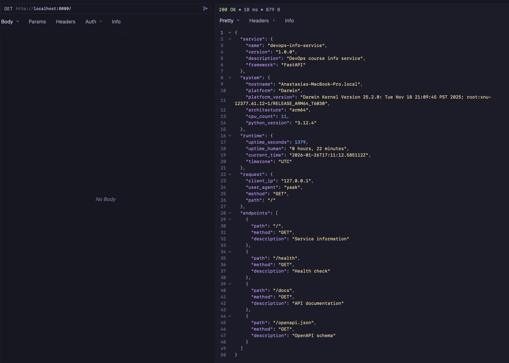
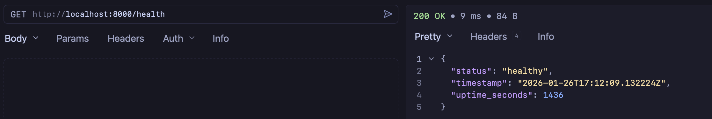
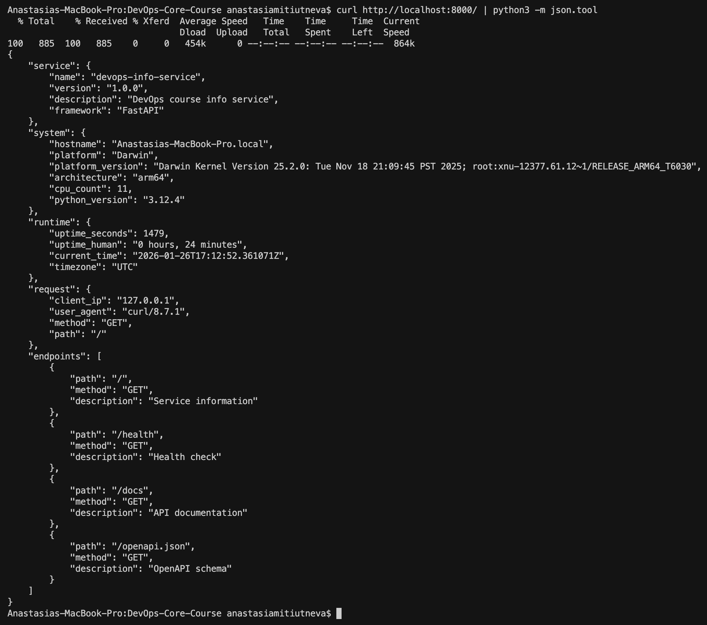

# Lab 01 - DevOps Info Service Implementation

## Framework Selection

### Choice: FastAPI

I selected **FastAPI** as the web framework for this DevOps Info Service.

### Justification

FastAPI is a modern, high-performance web framework for building APIs with Python 3.11+ based on standard Python type hints. Here's why it's the best choice for this project:

1. **Automatic API Documentation**: FastAPI automatically generates interactive API documentation (Swagger UI) at `/docs` and ReDoc at `/redoc`, eliminating the need for manual documentation maintenance.

2. **Type Safety & Validation**: Built on Pydantic, FastAPI provides automatic request validation, serialization, and type checking based on Python type hints, reducing bugs and improving code quality.

3. **Production Ready**: Built on Starlette and Pydantic, both battle-tested libraries used in production environments.

### Framework Comparison

| Feature | FastAPI | Flask | Django |
|---------|---------|-------|--------|
| **Performance** | ⭐⭐⭐⭐⭐ Very Fast | ⭐⭐⭐ Moderate | ⭐⭐⭐ Moderate |
| **Learning Curve** | ⭐⭐⭐⭐ Easy | ⭐⭐⭐⭐⭐ Very Easy | ⭐⭐ Steep |
| **API Documentation** | ⭐⭐⭐⭐⭐ Automatic | ⭐⭐ Manual | ⭐⭐⭐ Manual |
| **Type Safety** | ⭐⭐⭐⭐⭐ Built-in | ⭐⭐ Optional | ⭐⭐⭐ Optional |
| **Async Support** | ⭐⭐⭐⭐⭐ Native | ⭐⭐ Limited | ⭐⭐⭐ Good |
| **Flexibility** | ⭐⭐⭐⭐ High | ⭐⭐⭐⭐⭐ Very High | ⭐⭐⭐ Moderate |
| **ORM Included** | ❌ No | ❌ No | ✅ Yes |
| **Best For** | APIs, Microservices | Small apps, Prototyping | Full-stack apps |

**Conclusion**: For a DevOps monitoring service focused on API endpoints, FastAPI provides the best balance of performance, developer experience, and automatic documentation features.

## Best Practices Applied

### 1. Clean Code Organization

**Practice**: Clear function names, proper imports grouping, minimal comments, PEP 8 compliance.

**Implementation**:
```python
# Imports grouped by standard library, third-party, local
import os
import socket
import platform
import logging
from datetime import datetime, timezone
from typing import Dict, Any

from fastapi import FastAPI, Request
from fastapi.responses import JSONResponse
```

**Importance**: Well-organized code is easier to read, maintain, and debug. Following PEP 8 ensures consistency with the Python community standards.

### 2. Error Handling

**Practice**: Comprehensive error handling for HTTP exceptions, validation errors, and unexpected exceptions.

**Implementation**:
```python
@app.exception_handler(StarletteHTTPException)
async def http_exception_handler(request: Request, exc: StarletteHTTPException):
    """Handle HTTP exceptions."""
    logger.warning(f"HTTP {exc.status_code}: {exc.detail} for {request.url.path}")
    return JSONResponse(
        status_code=exc.status_code,
        content={
            'error': exc.detail,
            'status_code': exc.status_code,
            'path': request.url.path
        }
    )
```

**Importance**: Proper error handling provides meaningful feedback to API consumers and prevents application crashes. It's essential for production-ready services.

### 3. Logging

**Practice**: Structured logging with appropriate log levels.

**Implementation**:
```python
logging.basicConfig(
    level=logging.INFO,
    format='%(asctime)s - %(name)s - %(levelname)s - %(message)s'
)
logger = logging.getLogger(__name__)

logger.info(f"Request: {request.method} {request.url.path} from {request.client.host}")
```

**Importance**: Logging is crucial for debugging, monitoring, and understanding application behavior in production. Structured logs make it easier to search and analyze.

### 4. Type Hints

**Practice**: Using Python type hints for function parameters and return types.

**Implementation**:
```python
def get_system_info() -> Dict[str, Any]:
    """Collect system information."""
    return {
        'hostname': socket.gethostname(),
        # ...
    }
```

**Importance**: Type hints improve code readability, enable better IDE support, and help catch errors early. FastAPI uses them for automatic validation and documentation.

### 5. Configuration via Environment Variables

**Practice**: Making the application configurable without code changes.

**Implementation**:
```python
HOST = os.getenv('HOST', '0.0.0.0')
PORT = int(os.getenv('PORT', 5000))
DEBUG = os.getenv('DEBUG', 'False').lower() == 'true'
```

**Importance**: Environment-based configuration allows the same code to run in different environments (development, staging, production) without modification, following the 12-factor app methodology.

### 6. Function Decomposition

**Practice**: Breaking down complex logic into small, focused functions.

**Implementation**:
- `get_system_info()` - Collects system information
- `get_uptime()` - Calculates uptime
- `get_runtime_info()` - Gathers runtime statistics
- `get_request_info()` - Extracts request metadata

**Importance**: Small, focused functions are easier to test, debug, and maintain. They follow the Single Responsibility Principle.

## API Documentation

### Endpoint: `GET /`

**Description**: Returns comprehensive service and system information.

**Request**:
```bash
curl http://localhost:5000/
```

**Response** (200 OK):
```json
{
  "service": {
    "name": "devops-info-service",
    "version": "1.0.0",
    "description": "DevOps course info service",
    "framework": "FastAPI"
  },
  "system": {
    "hostname": "my-laptop",
    "platform": "Darwin",
    "platform_version": "Darwin Kernel Version 25.2.0",
    "architecture": "arm64",
    "cpu_count": 8,
    "python_version": "3.11.0"
  },
  "runtime": {
    "uptime_seconds": 3600,
    "uptime_human": "1 hour, 0 minutes",
    "current_time": "2026-01-26T14:30:00.000Z",
    "timezone": "UTC"
  },
  "request": {
    "client_ip": "127.0.0.1",
    "user_agent": "curl/7.81.0",
    "method": "GET",
    "path": "/"
  },
  "endpoints": [
    {"path": "/", "method": "GET", "description": "Service information"},
    {"path": "/health", "method": "GET", "description": "Health check"},
    {"path": "/docs", "method": "GET", "description": "API documentation"},
    {"path": "/openapi.json", "method": "GET", "description": "OpenAPI schema"}
  ]
}
```

### Endpoint: `GET /health`

**Description**: Health check endpoint for monitoring and Kubernetes probes.

**Request**:
```bash
curl http://localhost:5000/health
```

**Response** (200 OK):
```json
{
  "status": "healthy",
  "timestamp": "2026-01-26T14:30:00.000Z",
  "uptime_seconds": 3600
}
```

### Testing Commands

```bash
# Test main endpoint
curl http://localhost:5000/ | python -m json.tool

# Test health endpoint
curl http://localhost:5000/health

# Test with custom port
PORT=8080 python app.py
curl http://localhost:8080/

# Test with custom host
HOST=127.0.0.1 PORT=3000 python app.py
curl http://127.0.0.1:3000/
```

## Testing Evidence

### Screenshots

#### 1. Main Endpoint - Complete JSON Response



The main endpoint (`GET /`) returns comprehensive service information including system details, runtime statistics, and request metadata.

#### 2. Health Check Endpoint



The health check endpoint (`GET /health`) returns the service status, timestamp, and uptime in seconds.

#### 3. Formatted JSON Output



Pretty-printed JSON output using `python3 -m json.tool` for better readability.

### Terminal Output Example

```bash
PORT=8000 python3 app.py
2026-01-26 19:48:12,994 - __main__ - INFO - Starting DevOps Info Service on 0.0.0.0:8000
INFO:     Started server process [917]
INFO:     Waiting for application startup.
INFO:     Application startup complete.
INFO:     Uvicorn running on http://0.0.0.0:8000 (Press CTRL+C to quit)
INFO:     127.0.0.1:59782 - "GET /health HTTP/1.1" 200 OK
```

## Challenges & Solutions

### Challenge 1: Uptime Human-Readable Format

**Problem**: Converting seconds to a human-readable format with proper pluralization.

**Solution**: Implemented a function that calculates hours and minutes, and uses conditional pluralization:
```python
hours = seconds // 3600
minutes = (seconds % 3600) // 60
return {
    'seconds': seconds,
    'human': f"{hours} hour{'s' if hours != 1 else ''}, {minutes} minute{'s' if minutes != 1 else ''}"
}
```

### Challenge 2: Client IP Extraction

**Problem**: FastAPI's `request.client` can be `None` in some edge cases.

**Solution**: Added null checks:
```python
client_ip = request.client.host if request.client else 'unknown'
```

## GitHub Community

### Why Starring Repositories Matters

Stars help you bookmark interesting projects for later reference. Your starred repositories appear in your GitHub profile, creating a curated list of tools and projects you find valuable.

### How Following Developers Helps

By following experienced developers, professors, and classmates, you can learn from their code, commit patterns, and project structures. This exposure to different coding styles and solutions enhances your own development skills.
