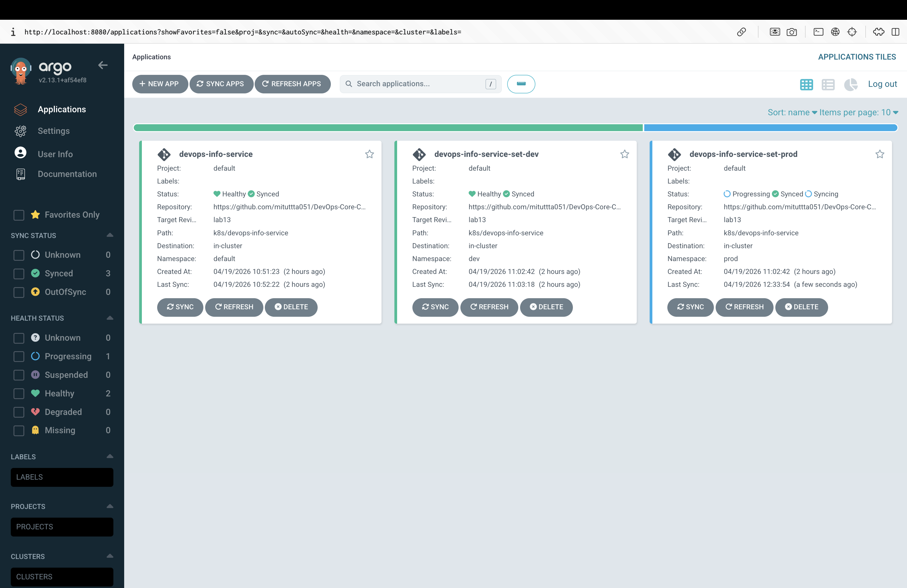
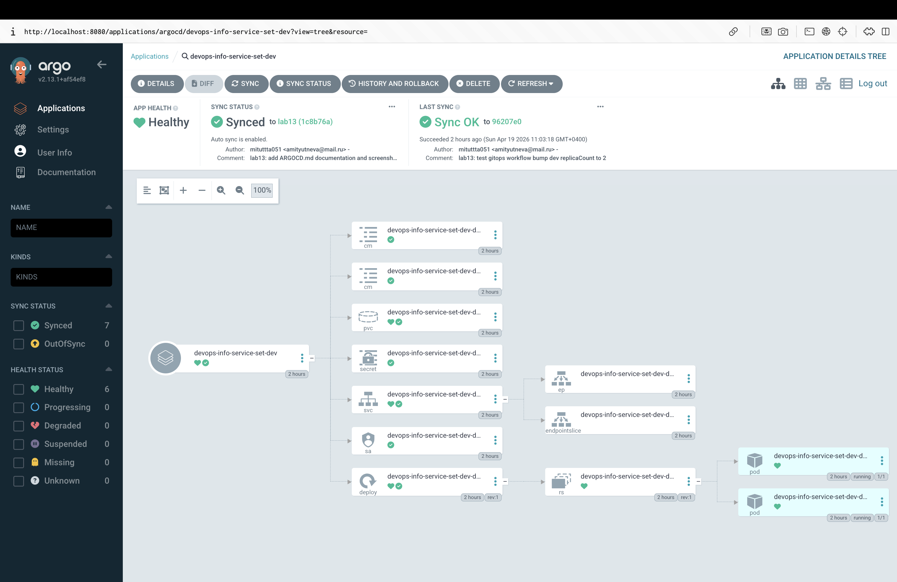
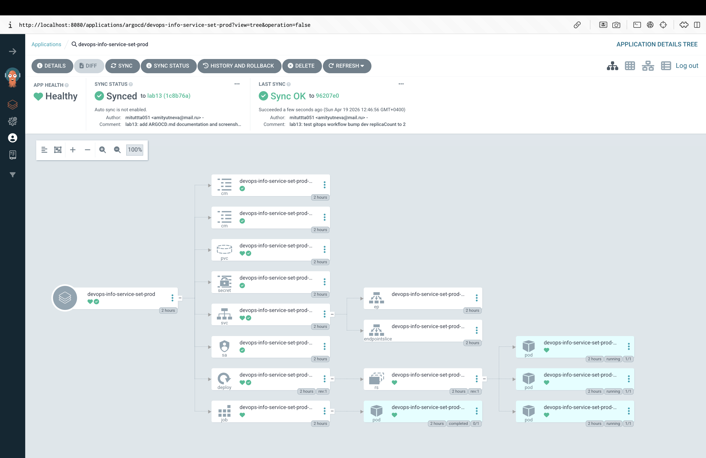
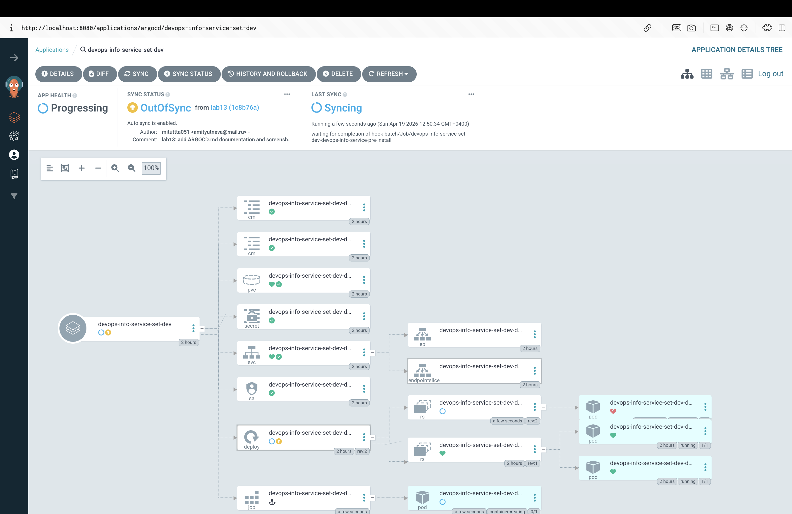
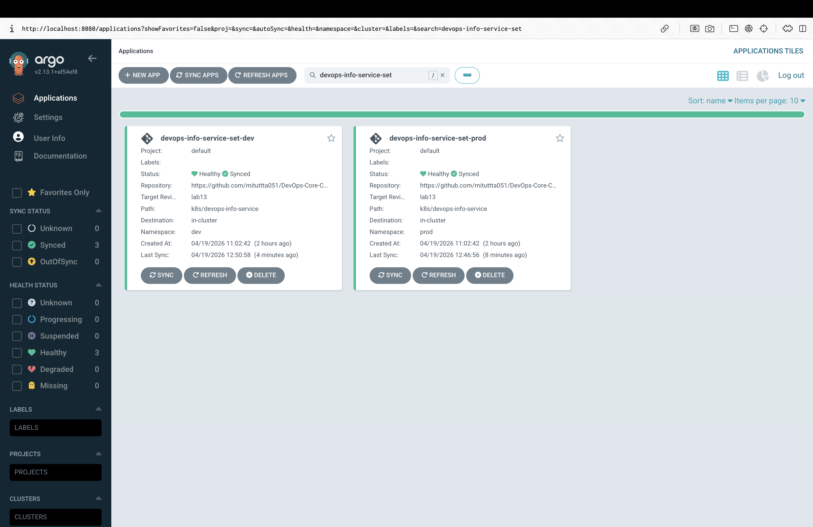

# Lab 13 — GitOps with ArgoCD

This document covers GitOps continuous delivery with ArgoCD for the `devops-info-service` Helm chart originally built in Labs 10‑12.

- **Chart path:** `k8s/devops-info-service`
- **Manifests path:** `k8s/argocd/`
- **Git branch used as source of truth:** `lab13`
- **ArgoCD version:** `v2.13.1` (installed via Helm chart `argo-cd 7.7.7`)

---

## 1. ArgoCD Setup

### Installation

ArgoCD is installed via the official Helm chart with HTTP‑only server (`server.insecure=true`) so the CLI can connect via `kubectl port-forward` without TLS certificate trust issues.

```bash
helm repo add argo https://argoproj.github.io/argo-helm
helm repo update
kubectl create namespace argocd

cat > argocd-values.yaml <<'YAML'
configs:
  params:
    server.insecure: true
YAML

helm install argocd argo/argo-cd \
  --namespace argocd \
  --version 7.7.7 \
  -f argocd-values.yaml

kubectl wait --for=condition=ready pod \
  -l app.kubernetes.io/name=argocd-server \
  -n argocd --timeout=300s
```

Verification:

```bash
$ kubectl get pods -n argocd
NAME                                                READY   STATUS    RESTARTS   AGE
argocd-application-controller-0                     1/1     Running   0          ...
argocd-applicationset-controller-...                1/1     Running   0          ...
argocd-dex-server-...                               1/1     Running   0          ...
argocd-notifications-controller-...                 1/1     Running   0          ...
argocd-redis-...                                    1/1     Running   0          ...
argocd-repo-server-...                              1/1     Running   0          ...
argocd-server-...                                   1/1     Running   0          ...
```

### UI access

```bash
kubectl port-forward svc/argocd-server -n argocd 8080:80 &
# open http://localhost:8080
```

Retrieve the initial admin password:

```bash
kubectl -n argocd get secret argocd-initial-admin-secret \
  -o jsonpath="{.data.password}" | base64 -d
```

Login: `admin` / `<password from secret>`.

### CLI access

```bash
brew install argocd                             # macOS
argocd login localhost:8080 --plaintext \
  --username admin --password "$PASSWORD"
argocd version
argocd cluster list
```

`--plaintext` is used because the server is configured with `server.insecure`. If you keep TLS on the server you must use `--insecure` (skip cert verification) instead.

---

## 2. Application Configuration

All Application manifests live in `k8s/argocd/`. They share the same `source`:

- **repoURL:** `https://github.com/mituttta051/DevOps-Core-Course.git`
- **targetRevision:** `lab13`
- **path:** `k8s/devops-info-service`

### Main Application (`application.yaml`)

Deploys the chart with the default `values.yaml` into the `default` namespace. Sync policy is **manual**. Used to demonstrate the basic GitOps flow.

Apply and sync:

```bash
kubectl apply -f k8s/argocd/application.yaml
argocd app sync devops-info-service
argocd app get devops-info-service
```

### Sync status indicators

| Status        | Meaning                                       |
| ------------- | --------------------------------------------- |
| `Synced`      | Live state matches Git                        |
| `OutOfSync`   | Git has changes not yet applied               |
| `Unknown`     | ArgoCD cannot determine state yet             |
| `Healthy`     | All resources report healthy                  |
| `Degraded`    | Some resources are unhealthy                  |
| `Progressing` | Rollout in progress                           |

### GitOps workflow verification

With the main application deployed:

1. Edit `k8s/devops-info-service/values-dev.yaml` and bump `replicaCount`.
2. `git commit` and `git push` the change to `lab13`.
3. ArgoCD detects drift during its next poll cycle (default ~3 min) or on a manual refresh.
4. The dev application (auto-sync) reconciles automatically; the main/prod apps show `OutOfSync` and require a manual sync.

Live observation from this lab:

```
=== GitOps workflow test: bump dev replicaCount 1 → 2 ===
Sync Status:        OutOfSync from lab13 (96207e0)   # after push
...
Dev replicas now: 2
Auto-sync applied after: 13s
```

---

## 3. Multi-Environment Deployment

Two parallel applications are generated — `devops-info-service-dev` (namespace `dev`) and `devops-info-service-prod` (namespace `prod`). They reuse the same chart but layer environment-specific `valueFiles`:

```yaml
source:
  path: k8s/devops-info-service
  helm:
    valueFiles:
      - values.yaml
      - values-dev.yaml      # or values-prod.yaml
```

### Namespaces

```bash
kubectl create namespace dev
kubectl create namespace prod
```

`syncOptions: [CreateNamespace=true]` also lets ArgoCD create them if missing.

### Configuration differences

| Setting           | values.yaml (main) | values-dev.yaml | values-prod.yaml |
| ----------------- | ------------------ | --------------- | ---------------- |
| `replicaCount`    | 3                  | 2               | 3                |
| `service.type`    | `NodePort` (30080) | `NodePort` (30081) | `LoadBalancer` |
| `resources.limits.cpu` | `200m`        | `100m`          | `500m`           |
| `resources.limits.memory` | `256Mi`    | `128Mi`         | `512Mi`          |
| `APP_RELEASE` env | `v1`               | `dev`           | `v1`             |

> **nodePort note:** `values.yaml` and `values-dev.yaml` use different nodePorts (30080 vs 30081) because nodePorts are cluster-wide unique; without this the dev service fails to create while the main service owns 30080.

### Sync policy differences

| Application                  | Sync policy  | `automated` | `prune` | `selfHeal` |
| ---------------------------- | ------------ | ----------- | ------- | ---------- |
| `devops-info-service`        | Manual       | —           | —       | —          |
| `devops-info-service-dev`    | Automated    | ✔           | ✔       | ✔          |
| `devops-info-service-prod`   | Manual       | —           | —       | —          |

### Why manual for production?

- Change review gate before a release hits production.
- Controlled release timing (maintenance windows).
- Compliance / change-management approvals.
- Explicit rollback decision instead of automatic revert.

### Verification

```bash
$ argocd app list
NAME                                 NAMESPACE  STATUS  HEALTH   SYNCPOLICY   TARGET
argocd/devops-info-service           default    Synced  Healthy  Manual       lab13
argocd/devops-info-service-set-dev   dev        Synced  Healthy  Auto-Prune   lab13
argocd/devops-info-service-set-prod  prod       Synced  Healthy  Manual       lab13

$ kubectl get deploy -n dev
devops-info-service-set-dev-devops-info-service     2/2     ...

$ kubectl get deploy -n prod
devops-info-service-set-prod-devops-info-service    3/3     ...
```

---

## 4. Self-Healing & Drift Detection

All three self-healing experiments were executed against the auto-sync `dev` application.

### 4.1 Manual scale (replicas)

```
BEFORE   2026-04-19T06:58:40Z   spec.replicas=1
SCALE    kubectl scale deployment ... --replicas=5
AFTER    2026-04-19T06:58:43Z   spec.replicas=1   (reverted)
```

A second run with `--replicas=7` required a manual `argocd app get … --refresh` because ArgoCD’s default reconciliation interval is 180 s. After the refresh the self-heal controller reverted replicas back to 1 within ~1 second.

### 4.2 Image tag drift

```
$ kubectl get deploy -n dev .. -o jsonpath='{.spec.template.spec.containers[0].image}'
mituta/devops-info-service:lab02                         # desired

$ kubectl set image deployment/... devops-info-service=mituta/devops-info-service:lab01
mituta/devops-info-service:lab01                         # drift

$ argocd app get devops-info-service-dev --refresh
Sync Status: Synced → Healthy

$ kubectl get deploy ... -o jsonpath='{.spec.template.spec.containers[0].image}'
mituta/devops-info-service:lab02                         # reverted
```

Image field is part of the Helm-rendered spec, so ArgoCD detects the diff and self-heal reverts it.

### 4.3 Pod deletion

```
$ POD=$(kubectl get pod -n dev -l app.kubernetes.io/name=devops-info-service -o jsonpath='{.items[0].metadata.name}')
$ kubectl delete pod -n dev $POD
pod "...-l6h65" deleted

$ kubectl get pods -n dev
NAME                                                  READY   STATUS    RESTARTS   AGE
devops-info-service-set-dev-devops-info-service-...-vlsfr   1/1   Running   0   7s
```

> **This recovery is Kubernetes, not ArgoCD.** The Deployment’s ReplicaSet controller observes that the desired pod count isn’t met and creates a new pod. ArgoCD’s self-heal operates on the **declared manifest** level; Kubernetes self-healing operates on the **runtime replica count** level.

### 4.4 Label drift (did not trigger self-heal)

Adding an out-of-band label on the deployment via `kubectl label deployment/... drift=test` is **not** detected as drift by ArgoCD. Labels added outside the Helm-rendered manifest are treated as additive metadata and remain until manually removed. Only fields present in the rendered manifest are reconciled.

### Kubernetes vs ArgoCD self-healing

| Layer      | Trigger                                    | Example                              |
| ---------- | ------------------------------------------ | ------------------------------------ |
| Kubernetes | Runtime state differs from `spec` (pods)   | Pod deleted → ReplicaSet recreates it |
| ArgoCD     | Cluster manifests differ from Git          | Image tag changed → revert to Git    |

### What triggers an ArgoCD sync?

1. `syncPolicy.automated` + observed drift, during the periodic reconciliation.
2. A manual `argocd app sync` / UI "Sync" button.
3. Explicit refresh (`argocd app get ... --refresh` / `--hard-refresh`).
4. Git webhook (if configured) for immediate reconciliation.

Default poll interval: **180 s** (`timeout.reconciliation` in `argocd-cm`).

---

## 5. ApplicationSet (bonus)

`k8s/argocd/applicationset.yaml` replaces the individual `application-dev.yaml` / `application-prod.yaml` manifests with a single **ApplicationSet** using a **List generator**.

### Manifest outline

```yaml
kind: ApplicationSet
spec:
  goTemplate: true
  generators:
    - list:
        elements:
          - env: dev
            namespace: dev
            valuesFile: values-dev.yaml
            autoSync: "true"
          - env: prod
            namespace: prod
            valuesFile: values-prod.yaml
            autoSync: "false"
  template:
    metadata:
      name: 'devops-info-service-set-{{.env}}'
    spec:
      source:
        path: k8s/devops-info-service
        helm:
          valueFiles:
            - values.yaml
            - '{{.valuesFile}}'
      destination:
        namespace: '{{.namespace}}'
      syncPolicy:
        syncOptions: [CreateNamespace=true]
  templatePatch: |
    {{- if eq .autoSync "true" }}
    spec:
      syncPolicy:
        automated:
          prune: true
          selfHeal: true
    {{- end }}
```

`templatePatch` conditionally injects the `automated` block only for the dev element, keeping prod manual. Without `templatePatch`, ApplicationSet can’t express conditional fields with the List generator alone.

Result:

```
$ kubectl get applicationset -n argocd
NAME                      AGE
devops-info-service-set   ...

$ argocd app list
argocd/devops-info-service-set-dev    dev   Synced  Healthy  Auto-Prune  lab13
argocd/devops-info-service-set-prod   prod  Synced  Healthy  Manual      lab13
```

### Generators overview

| Generator | Use case                                                             |
| --------- | -------------------------------------------------------------------- |
| `list`    | Fixed set of parameters (what we use for two environments)           |
| `cluster` | Fan out the same app across all registered clusters                  |
| `git`     | Discover apps by Git directories or JSON/YAML files                  |
| `matrix`  | Cartesian product of two generators (e.g. clusters × environments)   |
| `merge`   | Merge outputs of multiple generators by key                          |

### ApplicationSet vs individual Applications

- **Single source of truth** for the env matrix — add a new environment by adding one list element.
- **Fewer manifests** to keep in sync when the source path or repoURL changes.
- **Template reuse** avoids copy-paste drift between env manifests.
- **Automatic pruning** of generated Applications when removed from the generator list.

### When to prefer individual Applications

- The per-environment spec is very different (different charts, different projects).
- You need per-environment RBAC that is not expressible via a single Project.
- Strong isolation / blast-radius control between env manifests in Git.

---

## 6. Screenshots

### All applications

Main application + both ApplicationSet-generated apps (dev/prod) visible as tiles.



### Dev application — Healthy & Synced

`devops-info-service-set-dev` tree view after a GitOps push (replicaCount 1 → 2, rev:1). Auto-sync is enabled and everything is green.



### Prod application — Healthy & Synced

`devops-info-service-set-prod` tree view. Auto-sync is **not** enabled; sync happens manually.



### Self-heal in action

Dev application right after out-of-band `kubectl set image` drift. Status flips to **OutOfSync / Syncing**, the Deployment shows rev:2 while the previous ReplicaSet is still around — ArgoCD self-heal is reverting the image tag back to the Git-declared value.



### ApplicationSet generated applications

Filtered list (`search=devops-info-service-set`) showing both Applications produced by the `devops-info-service-set` ApplicationSet from the List generator (dev + prod elements).



---

## 7. Manual verification checklist

If you are picking this lab up fresh, run these checks in order:

```bash
# 1. Cluster + ArgoCD up
minikube status
kubectl get pods -n argocd

# 2. Port-forward + login
kubectl port-forward svc/argocd-server -n argocd 8080:80 &
PASS=$(kubectl -n argocd get secret argocd-initial-admin-secret -o jsonpath="{.data.password}" | base64 -d)
argocd login localhost:8080 --plaintext --username admin --password "$PASS"

# 3. Apply Applications (or ApplicationSet)
kubectl apply -f k8s/argocd/application.yaml
kubectl apply -f k8s/argocd/applicationset.yaml

# 4. Sync
argocd app sync devops-info-service
argocd app sync devops-info-service-set-prod

# 5. Verify
argocd app list
kubectl get all -n default
kubectl get all -n dev
kubectl get all -n prod

# 6. Self-heal smoke test
kubectl scale deployment -n dev devops-info-service-set-dev-devops-info-service --replicas=5
argocd app get devops-info-service-set-dev --refresh
kubectl get deployment -n dev devops-info-service-set-dev-devops-info-service -o jsonpath='{.spec.replicas}'
# expected: 2 (from values-dev.yaml)
```
