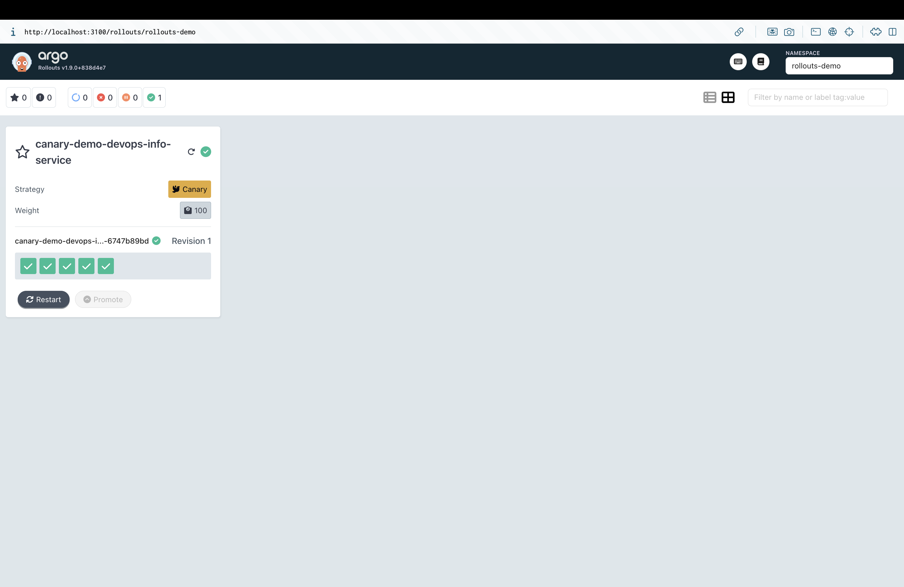
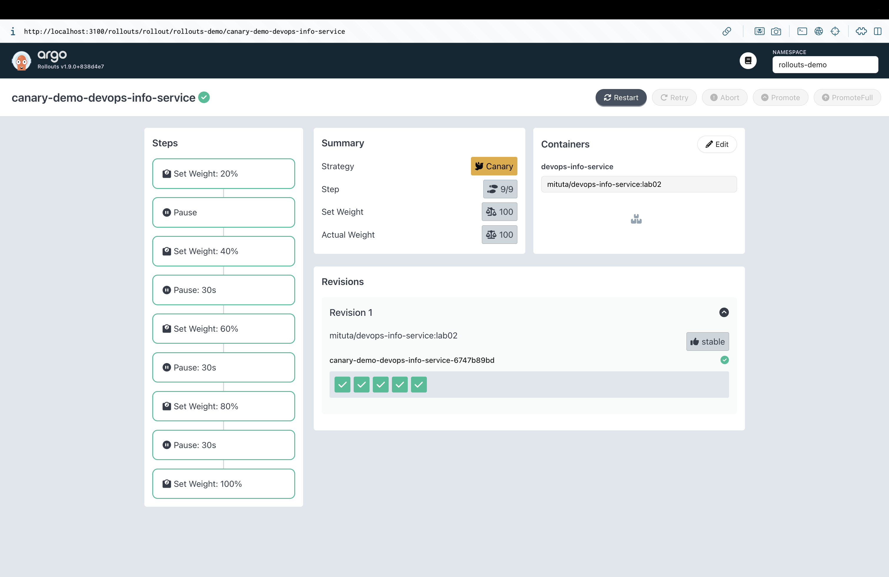
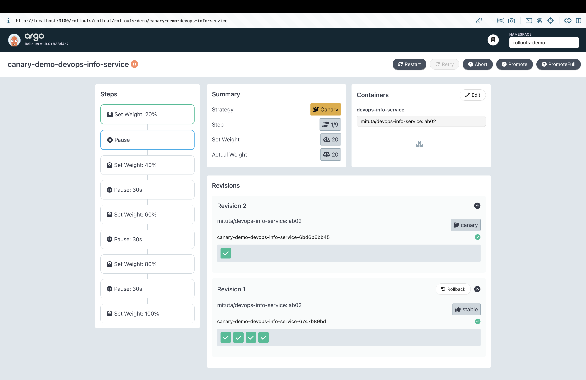
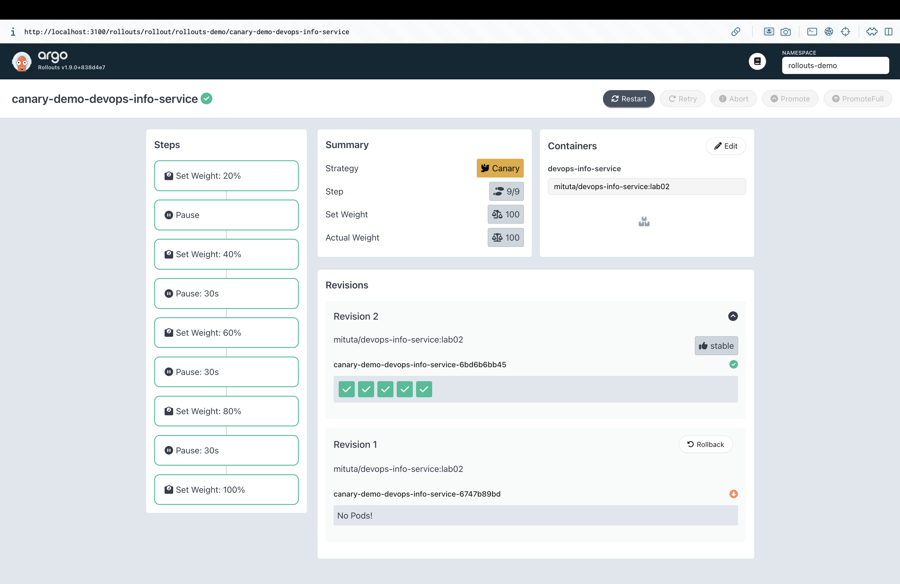
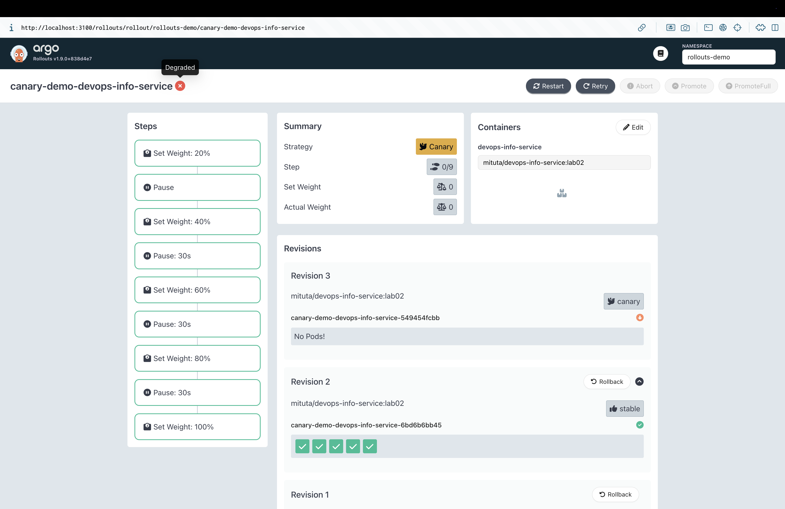
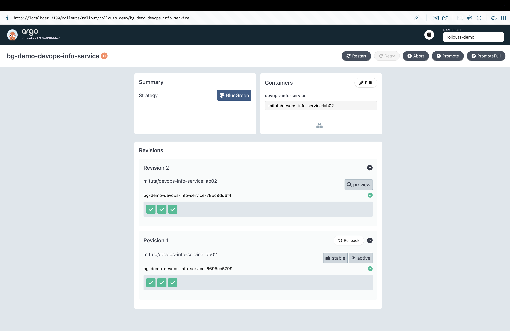
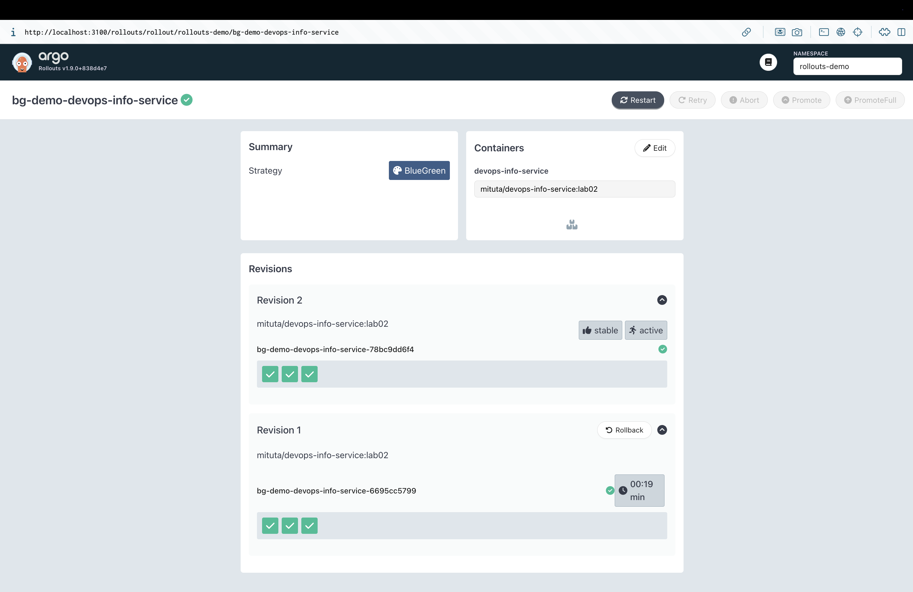
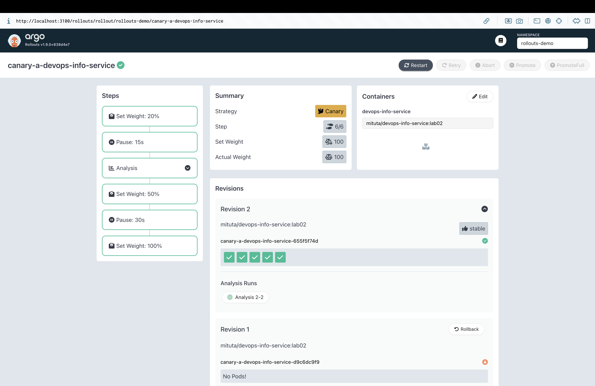

# Lab 14 — Progressive Delivery with Argo Rollouts

This document covers canary and blue-green progressive delivery for the `devops-info-service` Helm chart (originally built in Labs 10-12 and delivered via ArgoCD in Lab 13). The chart was extended with a `Rollout` template that replaces the `Deployment` whenever `rollout.enabled=true`, plus a preview `Service` and an `AnalysisTemplate` for the bonus task.

- **Chart path:** `k8s/devops-info-service`
- **Values files:**
  - `values.yaml` — default (`rollout.enabled=false`, classic `Deployment`)
  - `values-canary.yaml` — canary strategy with manual pause at 20%
  - `values-bluegreen.yaml` — blue-green strategy with active + preview services
  - `values-canary-analysis.yaml` — canary + automated `AnalysisTemplate` step (bonus)
- **Argo Rollouts version:** controller `v1.8.3` (latest install manifest), kubectl plugin `v1.8.3`
- **Tested namespace:** `rollouts-demo`

---

## 1. Argo Rollouts Setup

### Controller and dashboard installation

```bash
kubectl create namespace argo-rollouts
kubectl apply -n argo-rollouts \
  -f https://github.com/argoproj/argo-rollouts/releases/latest/download/install.yaml
kubectl apply -n argo-rollouts \
  -f https://github.com/argoproj/argo-rollouts/releases/latest/download/dashboard-install.yaml

# kubectl plugin (macOS, via Homebrew tap)
brew install argoproj/tap/kubectl-argo-rollouts
```

Verification:

```bash
$ kubectl argo rollouts version
kubectl-argo-rollouts: v1.8.3+49fa151

$ kubectl get pods -n argo-rollouts
NAME                                       READY   STATUS    RESTARTS   AGE
argo-rollouts-5f64f8d68-7cg7f              1/1     Running   0          4m
argo-rollouts-dashboard-755bbc64c-l6zwh    1/1     Running   0          4m
```

Dashboard is exposed via port-forward:

```bash
kubectl port-forward svc/argo-rollouts-dashboard -n argo-rollouts 3100:3100
# open http://localhost:3100/rollouts?namespace=<ns>
```



### Rollout vs Deployment

`argoproj.io/v1alpha1.Rollout` is a drop-in replacement for `apps/v1.Deployment`: the pod template (`spec.template`), selector, replicas, and revision history semantics are identical. The difference is in `spec.strategy`:

| Field                            | `Deployment`                     | `Rollout`                                                   |
|----------------------------------|----------------------------------|-------------------------------------------------------------|
| `strategy.type`                  | `RollingUpdate` / `Recreate`     | replaced with `strategy.canary` **or** `strategy.blueGreen` |
| Traffic shifting                 | not supported                    | replica weighting (default) or mesh/ingress traffic router  |
| Manual pause / auto pause        | not supported                    | `- pause: {}` or `- pause: {duration: 30s}` steps           |
| Analysis-driven promotion        | not supported                    | `- analysis: {templates: [...]}` steps, `AnalysisRun` CRD   |
| Preview service (blue-green)     | not supported                    | `blueGreen.previewService` + `blueGreen.activeService`      |
| Controller                       | built-in `kube-controller-manager` | `argo-rollouts` controller                                |
| Aborting in-flight release       | `kubectl rollout undo`           | `kubectl argo rollouts abort` / `retry` / `promote`         |

Everything else (Service, ConfigMap, Secret, HPA, PDB, probes, resources, volumes) stays the same, which is why the existing `Service`, `ConfigMap`, `Secret`, and `ServiceAccount` templates in this chart remained unchanged.

---

## 2. Canary Deployment

### Chart wiring

`templates/rollout.yaml` is only rendered when `rollout.enabled=true`; `templates/deployment.yaml` is gated with `{{- if not .Values.rollout.enabled }}`, so the two never exist at the same time. Canary strategy is selected with `rollout.strategy=canary`.

`values-canary.yaml` uses 5 replicas (so 20% → 1 pod is a clean canary unit) and the recommended progressive-traffic steps:

```yaml
rollout:
  enabled: true
  strategy: canary
  canary:
    steps:
      - setWeight: 20
      - pause: {}                 # manual promotion required
      - setWeight: 40
      - pause: { duration: 30s }
      - setWeight: 60
      - pause: { duration: 30s }
      - setWeight: 80
      - pause: { duration: 30s }
      - setWeight: 100
```

Without a service mesh, Argo Rollouts performs **replica-based weighting** — with 5 replicas, 20% means 1 canary pod behind the same `Service`. All existing traffic keeps flowing through `svc/canary-demo-devops-info-service`; the controller updates the ReplicaSet selector labels so that a fraction of traffic lands on the canary pod.

### Install + first rollout

```bash
kubectl create namespace rollouts-demo
helm upgrade --install canary-demo k8s/devops-info-service \
  -f k8s/devops-info-service/values-canary.yaml \
  -n rollouts-demo --wait

kubectl argo rollouts get rollout canary-demo-devops-info-service -n rollouts-demo
```



### Triggering an update

Change the image tag or any env var to create a new revision. Because `env[].value` must stay a string, use `--set-string`:

```bash
helm upgrade canary-demo k8s/devops-info-service \
  -f k8s/devops-info-service/values-canary.yaml \
  -n rollouts-demo \
  --set-string 'env[0].name=PORT' --set-string 'env[0].value=5000' \
  --set-string 'env[1].name=APP_RELEASE' --set-string 'env[1].value=canary-v2'
```

Within a few seconds the rollout pauses at step 1 (20%) waiting for manual promotion:

```
Status:        Paused
Message:       CanaryPauseStep
Step:          1/9
SetWeight:     20  ActualWeight: 20
Images:        mituta/devops-info-service:lab02 (canary, stable)
```



### Manual promotion and auto-progression

```bash
kubectl argo rollouts promote canary-demo-devops-info-service -n rollouts-demo
kubectl argo rollouts status canary-demo-devops-info-service -n rollouts-demo
```

Observed transitions from `status`:

```
Progressing - more replicas need to be updated
Paused - CanaryPauseStep           # step 3 (40%)
Progressing
Paused - CanaryPauseStep           # step 5 (60%)
Progressing
Paused - CanaryPauseStep           # step 7 (80%)
Progressing
Healthy                            # step 9 (100%)
```



### Abort / rollback

Start another rollout, then abort it while it is paused at 20%:

```bash
helm upgrade canary-demo k8s/devops-info-service \
  -f k8s/devops-info-service/values-canary.yaml -n rollouts-demo \
  --set-string 'env[1].name=APP_RELEASE' --set-string 'env[1].value=canary-v3'

kubectl argo rollouts abort canary-demo-devops-info-service -n rollouts-demo
kubectl argo rollouts get rollout canary-demo-devops-info-service -n rollouts-demo
```

The status flips to `Degraded` with `Message: RolloutAborted: Rollout aborted update to revision 3`, `SetWeight: 0`, and the stable ReplicaSet is scaled back to full capacity. To re-try the aborted release later:

```bash
kubectl argo rollouts retry rollout canary-demo-devops-info-service -n rollouts-demo
```



---

## 3. Blue-Green Deployment

### Chart wiring

`values-bluegreen.yaml` selects the blue-green strategy and exposes the preview environment on a second NodePort:

```yaml
rollout:
  enabled: true
  strategy: blueGreen
  blueGreen:
    autoPromotionEnabled: false        # manual promotion
    autoPromotionSeconds: 0            # ignored when autoPromotionEnabled=false
    scaleDownDelaySeconds: 30          # how long the old "blue" stays alive after switch
    previewService:
      type: NodePort
      nodePort: 30092
```

The Rollout references two services:

- `activeService: {{ fullname }}` — the standard `Service` from `templates/service.yaml`, serves production.
- `previewService: {{ fullname }}-preview` — rendered from `templates/service-preview.yaml` only when `rollout.strategy=blueGreen`. Selects the same labels but is re-pointed by the controller at the *green* ReplicaSet as soon as a new revision is deployed.

### Install + trigger green revision

```bash
helm upgrade --install bg-demo k8s/devops-info-service \
  -f k8s/devops-info-service/values-bluegreen.yaml \
  -n rollouts-demo --wait

# After the first install, there is one ReplicaSet labelled (stable, active).

helm upgrade bg-demo k8s/devops-info-service \
  -f k8s/devops-info-service/values-bluegreen.yaml -n rollouts-demo \
  --set-string 'env[0].name=PORT' --set-string 'env[0].value=5000' \
  --set-string 'env[1].name=APP_RELEASE' --set-string 'env[1].value=bluegreen-v2'
```

Within seconds a second ReplicaSet is created and labelled `preview`, and the rollout pauses:

```
Status:        Paused
Message:       BlueGreenPause
Images:        mituta/devops-info-service:lab02 (active, preview, stable)
Replicas:      Desired 3  Current 6  (3 blue + 3 green)
```



### Test the preview before promoting

```bash
# Production (blue) — still serving the old version
kubectl port-forward svc/bg-demo-devops-info-service -n rollouts-demo 8080:80
curl http://localhost:8080/health

# Preview (green) — new version, not reachable by end users
kubectl port-forward svc/bg-demo-devops-info-service-preview -n rollouts-demo 8081:80
curl http://localhost:8081/health
```

Because `APP_RELEASE` is part of the pod env, curl against port 8080 returns the old value while port 8081 returns `bluegreen-v2`. That is the whole point of blue-green: smoke-test the green pods end-to-end through the preview service while 100% of real users still hit blue.

### Promote and verify instant switch

```bash
kubectl argo rollouts promote bg-demo-devops-info-service -n rollouts-demo
```

The active service selector is re-pointed to the green ReplicaSet atomically. Compared to canary (where replicas are shifted 20/40/60/80/100 over minutes), blue-green flips all traffic in a single controller reconciliation — under a second in practice. The old blue ReplicaSet stays alive for `scaleDownDelaySeconds: 30` so that already-open connections drain cleanly.



### Instant rollback

```bash
kubectl argo rollouts undo bg-demo-devops-info-service -n rollouts-demo
```

`undo` creates a new revision that points the active service back at the previous ReplicaSet. Because those pods are still running (within the `scaleDownDelay`), the switch is immediate — no new pods need to be scheduled:

```
revision:3  bg-demo-devops-info-service-6695cc5799  stable,active
revision:2  bg-demo-devops-info-service-78bc9dd6f4
```

If the scale-down delay has already expired, the rollback is still fast (seconds) but it has to wait for the blue pods to come back up, so "instant" in blue-green really means "instant if the old ReplicaSet is still alive".

---

## 4. Strategy Comparison

| Criterion                   | Canary                                                      | Blue-Green                                                 |
|-----------------------------|-------------------------------------------------------------|------------------------------------------------------------|
| Traffic shifting            | Gradual, percentage-based                                   | All-or-nothing                                             |
| Resource footprint          | ~1x (canary pod shares stable headroom)                     | ~2x during rollout (blue + green run in parallel)          |
| Rollback speed              | Seconds (abort + shift back)                                | Sub-second if old ReplicaSet is still up                   |
| Manual checkpoints          | `- pause: {}` / time-based pauses between each weight       | `autoPromotionEnabled: false` gives one big checkpoint     |
| Preview environment         | No — canary pods serve real traffic                         | Yes — `previewService` exposes green without real traffic  |
| Automated analysis          | Per-step, fine-grained (`AnalysisTemplate` between weights) | Single "before promotion" pre-promotion analysis           |
| User-visible blast radius   | Small (only the canary % sees the new version at any time)  | Large (100% of traffic flips at promotion)                 |
| Best for                    | Customer-facing APIs where you can accept partial rollout   | Versioned APIs / DBs where versions must not coexist       |

### Recommendations for this project

- **`devops-info-service`** is a stateless HTTP service behind a `NodePort`/Ingress — canary is the better default, because it lets us catch regressions while only 20% of users see the new version.
- When the release is **backwards-incompatible** (e.g. introducing a new required env var, a schema change, or a breaking API response), switch to blue-green for the release and rely on the preview service for smoke tests before flipping.
- Under a proper service mesh (Istio, Linkerd) or the nginx-ingress traffic router, canary weighting becomes truly traffic-based (not replica-based), and 20% with 5 replicas would still be exactly 20% even with 100 replicas. Worth wiring up later under Lab 16's monitoring stack.

---

## 5. Bonus — Automated Analysis

### AnalysisTemplate

`templates/analysistemplate.yaml` is rendered only when `rollout.enabled=true` **and** `rollout.analysis.enabled=true`. It uses the `web` provider against the in-cluster `/health` endpoint:

```yaml
apiVersion: argoproj.io/v1alpha1
kind: AnalysisTemplate
metadata:
  name: {{ include "devops-info-service.fullname" . }}-health
spec:
  args:
    - name: service-name
      value: {{ include "devops-info-service.fullname" . }}
    - name: service-namespace
      value: {{ .Release.Namespace }}
    - name: service-port
      value: {{ .Values.service.port | quote }}
  metrics:
    - name: health-check
      interval: 10s
      count: 3
      failureLimit: 1
      successCondition: result == "healthy"
      provider:
        web:
          url: "http://{{args.service-name}}.{{args.service-namespace}}.svc.cluster.local:{{args.service-port}}/health"
          jsonPath: "{$.status}"
          timeoutSeconds: 5
```

The Python app's `GET /health` returns `{"status": "healthy", ...}` (see `app_python/app.py`), so the template polls it three times at 10s intervals and fails the canary if more than one probe comes back non-`healthy`.

### Canary + analysis

`values-canary-analysis.yaml` enables analysis and injects an analysis step via a simple marker. The Helm template detects `analysis: <string>` entries inside `rollout.canary.steps` and expands them to a fully-qualified analysis step that references the chart's `AnalysisTemplate`:

```yaml
# values-canary-analysis.yaml
rollout:
  enabled: true
  strategy: canary
  canary:
    steps:
      - setWeight: 20
      - pause:
          duration: 15s
      - analysis: auto          # rendered as `- analysis: {templates: [...]}`
      - setWeight: 50
      - pause:
          duration: 30s
      - setWeight: 100
  analysis:
    enabled: true
    interval: 10s
    count: 3
    failureLimit: 1
```

Rendered output (excerpt from `helm template`):

```yaml
strategy:
  canary:
    steps:
      - setWeight: 20
      - pause: { duration: 15s }
      - analysis:
          templates:
            - templateName: test-ca-devops-info-service-health
      - setWeight: 50
      - pause: { duration: 30s }
      - setWeight: 100
```

### Demonstrating auto-rollback

Deploy, then introduce an intentional failure (point `/health` at a non-existent port) and watch the rollout abort itself:

```bash
helm upgrade --install canary-a k8s/devops-info-service \
  -f k8s/devops-info-service/values-canary-analysis.yaml -n rollouts-demo --wait

# Force the probe target away from /health
helm upgrade canary-a k8s/devops-info-service \
  -f k8s/devops-info-service/values-canary-analysis.yaml -n rollouts-demo \
  --set-string 'env[1].name=APP_RELEASE' --set-string 'env[1].value=broken' \
  --set 'livenessProbe.httpGet.path=/does-not-exist'

kubectl argo rollouts get rollout canary-a-devops-info-service -n rollouts-demo -w
```

When the three `web` probes return `"not-found"` instead of `"healthy"`, the `AnalysisRun` transitions to `Failed`, the `Rollout` status goes to `Degraded` with `RolloutAborted: ... AnalysisRun ... Failed`, and the stable ReplicaSet is restored — no manual `abort` required.

### Successful analysis run

In the happy path, the analysis step completes, the rollout continues through the remaining weights, and the dashboard exposes the `AnalysisRun` under the stable revision's **Analysis Runs** section:



---

## 6. CLI Commands Reference

```bash
# Inspect
kubectl argo rollouts get rollout <name> -n <ns>            # snapshot
kubectl argo rollouts get rollout <name> -n <ns> -w         # live tree view
kubectl argo rollouts status <name> -n <ns> --timeout 3m    # blocking status
kubectl argo rollouts list rollouts -A

# Drive
kubectl argo rollouts promote <name> -n <ns>                # next step (or full promote with --full)
kubectl argo rollouts abort <name> -n <ns>                  # stop + shift traffic to stable
kubectl argo rollouts retry rollout <name> -n <ns>          # re-try an aborted rollout
kubectl argo rollouts undo <name> -n <ns> --to-revision <n> # rollback to specific revision

# Image / spec shortcuts
kubectl argo rollouts set image <name> <container>=<image> -n <ns>
kubectl argo rollouts restart <name> -n <ns>

# Analysis
kubectl get analysistemplate,analysisrun -n <ns>
kubectl describe analysisrun <name> -n <ns>

# Dashboard
kubectl port-forward svc/argo-rollouts-dashboard -n argo-rollouts 3100:3100
```

### Troubleshooting tips

- `helm upgrade` can fail with *"conflict with argo-rollouts-controller using v1: .spec.selector"* on the preview service — this is because the controller owns selector labels it injects into the services. Either re-apply with `helm upgrade --force` (recreates the Service) or let the rollout keep progressing: the Rollout spec itself is already applied.
- `env[].value: expected string, got ...` — always set env overrides via `--set-string`, never `--set`, because `env` items are strongly typed.
- No traffic shifting visible at 20%? With fewer than 5 replicas, `setWeight: 20` rounds down to a single canary pod (or zero). Either increase `replicaCount` or switch to a traffic router (ingress-nginx, Istio) for true percentage splits.

---

## 7. Verification checklist

- [x] `argo-rollouts` controller + dashboard Deployments are `Running`
- [x] `kubectl argo rollouts version` returns `v1.8.x`
- [x] `helm template -f values-canary.yaml` renders a `Rollout` with 9 canary steps and **no** `Deployment`
- [x] `helm template -f values-bluegreen.yaml` renders a `Rollout` with `blueGreen.activeService` / `previewService` and a second `Service` suffixed `-preview`
- [x] Canary paused at 20% after a new revision until `promote`; subsequent pauses auto-resume after 30s
- [x] `abort` flips `Rollout.status` to `Degraded` and scales the canary pod back to zero
- [x] Blue-green `promote` switches `activeService`'s selector to the green ReplicaSet; `undo` reverts it
- [x] Bonus `AnalysisTemplate` renders with templated `service-name`/`-namespace`/`-port` args and the `analysis: auto` marker expands to a real analysis step

---

## Looking ahead

- **Lab 15** reuses the same chart skeleton but swaps `Rollout` for `StatefulSet` — progressive delivery does not apply to stateful apps the same way.
- **Lab 16** adds Prometheus: once it is up, the `AnalysisTemplate` `provider.web` can be swapped for `provider.prometheus` using an error-rate query.
