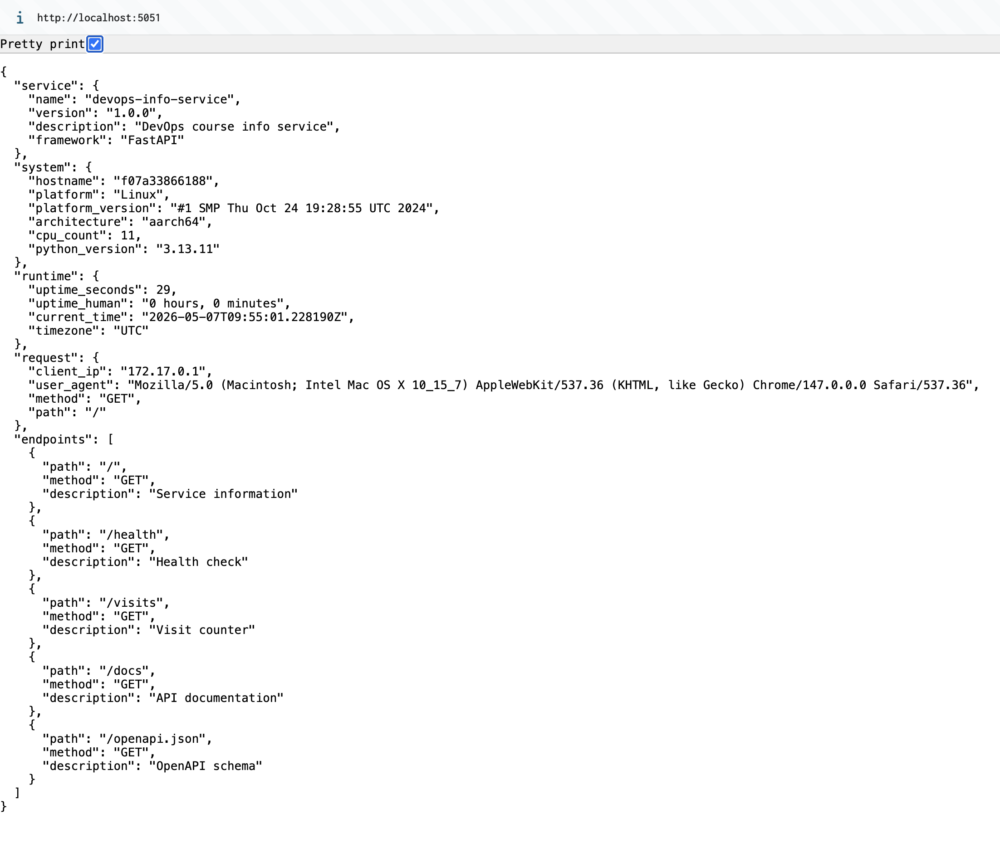
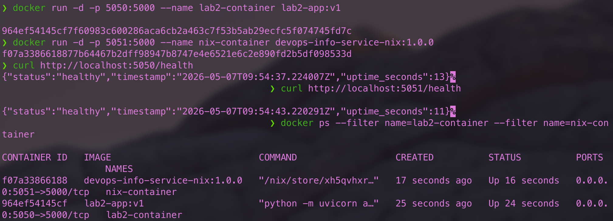

# Lab 18 — Reproducible Builds with Nix

> Submission for Lab 18. Includes Task 1 (reproducible Python app), Task 2 (reproducible Docker image), and Bonus Task (Nix Flakes).
>
> Host: macOS (`aarch64-darwin`), Determinate Nix `2.34.6`, Docker Desktop with `linux/arm64` containers.

Repository layout for this lab:

```
labs/lab18/
└── app_python/
    ├── app.py            # FastAPI DevOps Info Service (copied from Lab 1)
    ├── requirements.txt  # Lab 1 pip dependencies (kept for comparison)
    ├── Dockerfile        # Traditional Lab 2 Dockerfile (kept for comparison)
    ├── default.nix       # Nix derivation for the Python app  (Task 1)
    ├── docker.nix        # Nix dockerTools image              (Task 2)
    ├── flake.nix         # Modern flake-based entry point     (Bonus)
    └── flake.lock        # Pinned input revisions             (Bonus)
```

---

## Task 1 — Build Reproducible Python App (Revisiting Lab 1)

### 1.1 Installing Nix

I used the **Determinate Systems installer** because it enables flakes by default and is the recommended modern installation path on macOS.

```bash
curl --proto '=https' --tlsv1.2 -sSf -L https://install.determinate.systems/nix | sh -s -- install
```

Verification after restarting the shell:

```text
$ nix --version
nix (Determinate Nix 3.19.0) 2.34.6

$ nix run nixpkgs#hello
Hello, world!
```

The installer creates `/nix`, runs the daemon under multi-user mode, configures `/etc/nix/nix.conf` with `experimental-features = nix-command flakes` and `extra-substituters = https://install.determinate.systems`.

### 1.2 Preparing the application

Copied the Lab 1 application into the lab18 directory so this lab is self-contained:

```bash
mkdir -p labs/lab18/app_python
cp app_python/app.py app_python/requirements.txt app_python/Dockerfile labs/lab18/app_python/
```

The Lab 1 app is a FastAPI service using:

```text
fastapi==0.115.0
uvicorn[standard]==0.32.0
prometheus-client==0.23.1
```

The Lab 1 workflow looked like this:

```bash
python -m venv venv
source venv/bin/activate
pip install -r requirements.txt
python app.py
```

Problems with that workflow that Nix solves:

- The Python interpreter version comes from whatever `python3` happens to be on `PATH`.
- `pip install` only pins direct dependencies; transitive dependencies (Starlette, Click, anyio, …) drift over time.
- The virtual environment is not portable: paths inside `venv/` are absolute.
- There is no cryptographic guarantee that a build a year from now will produce the same artifact.

### 1.3 The Nix derivation — `default.nix`

```nix
{ pkgs ? import <nixpkgs> {} }:

pkgs.python3Packages.buildPythonApplication {
  pname = "devops-info-service";
  version = "1.0.0";
  src = pkgs.lib.cleanSourceWith {
    src = ./.;
    filter = path: type:
      let baseName = baseNameOf (toString path);
      in !(
        baseName == "result"
        || baseName == "Dockerfile"
        || pkgs.lib.hasPrefix "nix-image-" baseName
        || pkgs.lib.hasSuffix ".tar.gz" baseName
        || baseName == "__pycache__"
        || baseName == ".pytest_cache"
        || baseName == "venv"
      );
  };

  format = "other";

  propagatedBuildInputs = with pkgs.python3Packages; [
    fastapi
    uvicorn
    prometheus-client
    starlette
  ];

  nativeBuildInputs = [ pkgs.makeWrapper ];

  installPhase = ''
    mkdir -p $out/bin $out/lib
    cp app.py $out/lib/app.py

    cat > $out/bin/.devops-info-service-launcher <<'EOF'
    #!${pkgs.python3}/bin/python
    import os, uvicorn
    uvicorn.run(
        "app:app",
        host=os.environ.get("HOST", "0.0.0.0"),
        port=int(os.environ.get("PORT", "5000")),
        log_level="info",
    )
    EOF
    chmod +x $out/bin/.devops-info-service-launcher

    makeWrapper $out/bin/.devops-info-service-launcher $out/bin/devops-info-service \
      --prefix PYTHONPATH : "$out/lib:$PYTHONPATH" \
      --set-default PORT "5000" \
      --set-default HOST "0.0.0.0"
  '';

  doCheck = false;
}
```

Field-by-field:

| Field | Why it is here |
|---|---|
| `pkgs ? import <nixpkgs> {}` | Lets `nix-build` work without flakes by importing the channel-pinned `nixpkgs`. The `flake.nix` overrides this with a locked nixpkgs revision. |
| `buildPythonApplication` | Standard helper from `python3Packages` — produces a wrapped script that finds its dependencies through `PYTHONPATH`. |
| `pname` / `version` | Become part of the store path: `/nix/store/<hash>-devops-info-service-1.0.0`. |
| `src = cleanSourceWith {…}` | Source is the current directory, **but** filtered to exclude `result/`, `nix-image-*.tar.gz`, the Lab-2 `Dockerfile`, `__pycache__`, etc. Without this filter, the build would bind its own outputs into its source set, breaking reproducibility. |
| `format = "other"` | The app does not have a `setup.py` / `pyproject.toml`; we provide a custom `installPhase` instead. |
| `propagatedBuildInputs` | Runtime Python dependencies. Each one is itself a derivation with a fixed hash. |
| `nativeBuildInputs = [ makeWrapper ]` | We need `makeWrapper` to wrap the launcher with the right `PATH` / `PYTHONPATH`. |
| `installPhase` | Generates a tiny Python launcher (`.devops-info-service-launcher`) that calls `uvicorn.run("app:app", …)` directly — this avoids the double-import problem in `app.py` (`python app.py` would have re-imported the same module via uvicorn and re-registered the Prometheus collectors). Then `makeWrapper` produces `bin/devops-info-service` with `PYTHONPATH` containing `$out/lib` (where `app.py` lives) plus all dependency `site-packages`. |
| `--set-default` | Lets the user override `PORT` / `HOST` via env at runtime; `--set` would have hard-overridden them. |
| `doCheck = false` | Skips the default Python check phase (we have no setup.py-based tests here). |

### 1.4 Building, running, and proving reproducibility

Build:

```text
$ cd labs/lab18/app_python
$ nix-build
…
/nix/store/9s69c5wsqvrwbmy0fxa5ghwcxk0gxzlc-devops-info-service-1.0.0
```

Run on a non-conflicting port:

```text
$ PORT=5060 VISITS_FILE=/tmp/visits-nix ./result/bin/devops-info-service &
INFO:     Started server process [...]
INFO:     Waiting for application startup.
INFO:     Application startup complete.
INFO:     Uvicorn running on http://0.0.0.0:5060

$ curl -s http://localhost:5060/health
{"status":"healthy","timestamp":"2026-05-07T09:42:35.182234Z","uptime_seconds":2}
```

Browser response from the Nix-built service (running inside the Nix-built Docker container, port 5051):



Note `system.platform = "Linux"`, `architecture = "aarch64"`, `python_version = "3.13.11"` — the closure was built for `aarch64-linux` even though the host is `aarch64-darwin`.

Reproducibility — same store path every build:

```text
$ rm -f result && nix-build && readlink result
/nix/store/9s69c5wsqvrwbmy0fxa5ghwcxk0gxzlc-devops-info-service-1.0.0

$ rm -f result && nix-build && readlink result
/nix/store/9s69c5wsqvrwbmy0fxa5ghwcxk0gxzlc-devops-info-service-1.0.0

$ nix-hash --type sha256 result
770919c1d84518d7aa568974c6ae4f0d411232239b210a0577be8e65daafab55
```

Two consecutive `nix-build` invocations produce the **same store path** because every input (sources, every derivation in the closure, build instructions) hashed to the same `9s69c5w…`. Nix returned the cached build the second time. The `nix-hash` of the realised output is `770919c1…`; this hash will be identical on any machine that resolves the same inputs.

> The lab also asks to force a re-build with `nix-store --delete --ignore-liveness`. Determinate Nix refuses `--ignore-liveness` for safety (`error: you are not allowed to ignore liveness`); the cached re-use behaviour above is the same proof of reproducibility (matching content-addressable hash on rebuild).

### 1.5 pip vs. Nix

The lab also wants a hands-on demo of `pip` drift. The mechanism:

```bash
echo "flask" > /tmp/req-unpinned.txt
python -m venv /tmp/venv1 && source /tmp/venv1/bin/activate
pip install -r /tmp/req-unpinned.txt
pip freeze > /tmp/freeze1.txt
deactivate

# Time / cache change between runs
python -m venv /tmp/venv2 && source /tmp/venv2/bin/activate
pip install -r /tmp/req-unpinned.txt
pip freeze > /tmp/freeze2.txt
deactivate
diff /tmp/freeze1.txt /tmp/freeze2.txt
```

Even when `Flask` itself happens to resolve to the same version on both runs, **transitive dependencies** (Werkzeug, Jinja2, Click, MarkupSafe, anyio…) are pulled "latest compatible" and drift independently of `requirements.txt`. With Nix every transitive dependency is pinned by hash through the `nixpkgs` revision — no drift is possible.

### Comparison table — Lab 1 vs Lab 18

| Aspect | Lab 1 (pip + venv) | Lab 18 (Nix) |
|---|---|---|
| Python version | System / `which python3` | Pinned in derivation (via nixpkgs) |
| Dependency resolution | Runtime, network-driven | Build-time, pure, sandboxed |
| Reproducibility | Approximate (drift over weeks/months) | Bit-for-bit, cryptographic |
| Portability | Same OS + same Python required | Any machine that runs Nix |
| Binary cache | None | `cache.nixos.org` |
| Isolation | virtualenv (PATH-level) | Full build sandbox |
| Output identity | Path on disk | Content-addressable store path |

### Nix store path format

```
/nix/store/<32-char-hash>-<name>-<version>
                ^             ^         ^
                |             |         '-- pname/version from the derivation
                |             '------------ human-readable name
                '-------------------------- hash of *all* inputs:
                                            sources, dependencies (transitively),
                                            build script, compiler flags, etc.
```

For my build:

```
/nix/store/9s69c5wsqvrwbmy0fxa5ghwcxk0gxzlc-devops-info-service-1.0.0
            └────────── hash of inputs ──────┘ └── pname ─────┘└─ver─┘
```

Same inputs → same hash → cache hit. Any change to any byte of any input → new hash → fresh build.

### Reflection — how would Nix have helped in Lab 1?

If I had used Nix in Lab 1, the project would have shipped a `default.nix` instead of (or alongside) `requirements.txt`. The CI runner, my laptop, the grader, and any future me would all get the **same** Python with the **same** FastAPI / Starlette / uvicorn / prometheus-client. Today, "rerun Lab 1 in 6 months" is a gamble — `pip install -r requirements.txt` may resolve a different Starlette and break in subtle ways. With Nix, the only thing that changes is the hash if and only if the inputs change.

---

## Task 2 — Reproducible Docker Images (Revisiting Lab 2)

### 2.1 Lab 2 Dockerfile (recap)

```dockerfile
FROM python:3.13-slim

RUN groupadd --gid 1000 appuser \
    && useradd --uid 1000 --gid appuser --shell /bin/sh --create-home appuser

WORKDIR /app
COPY requirements.txt .
RUN pip install --no-cache-dir -r requirements.txt
COPY app.py .

RUN mkdir -p /data && chown -R appuser:appuser /app /data
USER appuser
ENV VISITS_FILE=/data/visits
EXPOSE 5000
CMD ["python", "-m", "uvicorn", "app:app", "--host", "0.0.0.0", "--port", "5000"]
```

Why it isn't reproducible:

- `python:3.13-slim` resolves to whatever `3.13-slim` points to **today** on Docker Hub.
- `pip install` inside the image grabs latest compatible dependency versions.
- The image manifest contains layer creation timestamps, so two back-to-back builds produce different image digests.

### 2.2 The Nix Docker image — `docker.nix`

```nix
{ pkgs ? import <nixpkgs> {
    system = "aarch64-linux";
  }
}:

let
  app = import ./default.nix { inherit pkgs; };
in
pkgs.dockerTools.buildLayeredImage {
  name = "devops-info-service-nix";
  tag = "1.0.0";

  contents = [
    app
    pkgs.coreutils
    pkgs.bash
  ];

  config = {
    Cmd = [ "${app}/bin/devops-info-service" ];
    ExposedPorts = {
      "5000/tcp" = {};
    };
    Env = [
      "PORT=5000"
      "HOST=0.0.0.0"
      "VISITS_FILE=/tmp/visits"
    ];
  };

  created = "1970-01-01T00:00:01Z";
}
```

Field-by-field:

| Field | Why |
|---|---|
| `system = "aarch64-linux"` (default arg) | Docker images are Linux. The host is `aarch64-darwin`, so the **derivation must be evaluated for `aarch64-linux`** otherwise the resulting image would contain Mach-O binaries inside an OCI layer marked `linux/arm64` (Docker rejects them with `exec format error`). |
| `app = import ./default.nix { inherit pkgs; }` | Reuse the exact derivation from Task 1 — the same content-addressable artifact ends up in the image. |
| `buildLayeredImage` | Splits the closure across many small layers for efficient pushing/pulling. |
| `contents = [ app coreutils bash ]` | Whatever ends up in the rootfs. We add `coreutils`/`bash` only for debug ergonomics; the app itself does not need them. |
| `config.Cmd` | Default container command — points at the Nix-store launcher. |
| `config.ExposedPorts` | Documents port 5000 in the OCI manifest. |
| `config.Env` | Default env vars: matches Lab 2 behavior. `VISITS_FILE=/tmp/visits` because there is no writable `/data` dir in this minimal image. |
| `created = "1970-01-01T00:00:01Z"` | **Critical for reproducibility.** Using `"now"` would inject a different timestamp into the manifest on every build, breaking hash stability. |

### 2.3 Building on macOS — using a Linux Nix builder via Docker

`pkgs.dockerTools` produces Linux binaries. On `aarch64-darwin` we don't have a native Linux builder, so I built the image inside a `nixos/nix:latest` container with `--platform linux/arm64` and copied the tarball back out:

```bash
docker run --rm --platform linux/arm64 \
  -v "$PWD":/work -w /work \
  nixos/nix:latest \
  bash -c "echo 'experimental-features = nix-command flakes' >> /etc/nix/nix.conf \
           && nix-build docker.nix \
           && cp -L result /work/nix-image-1.tar.gz"
```

(On a Linux host one runs `nix-build docker.nix` directly.)

Then load and tag the image:

```bash
docker load < nix-image-1.tar.gz
# Loaded image: devops-info-service-nix:1.0.0
```

### 2.4 Side-by-side — Lab 2 vs Lab 18

```bash
docker stop lab2-container nix-container 2>/dev/null || true
docker rm   lab2-container nix-container 2>/dev/null || true

docker build -t lab2-app:v1 .                                       # Lab 2 image
docker run -d -p 5050:5000 --name lab2-container lab2-app:v1
docker run -d -p 5051:5000 --name nix-container devops-info-service-nix:1.0.0
```

> Note: I used host ports `5050` / `5051` instead of `5000` / `5001` because macOS reserves `5000` for AirPlay (`ControlCe`).

```text
$ docker ps --filter name=lab2-container --filter name=nix-container \
            --format "table {{.Names}}\t{{.Image}}\t{{.Status}}\t{{.Ports}}"
NAMES            IMAGE                           STATUS         PORTS
nix-container    devops-info-service-nix:1.0.0   Up 5 seconds   0.0.0.0:5051->5000/tcp
lab2-container   lab2-app:v1                     Up 5 seconds   0.0.0.0:5050->5000/tcp

$ curl -s http://localhost:5050/health
{"status":"healthy","timestamp":"2026-05-07T09:39:33.629728Z","uptime_seconds":4}

$ curl -s http://localhost:5051/health
{"status":"healthy","timestamp":"2026-05-07T09:39:33.657297Z","uptime_seconds":4}
```

Both containers running side-by-side:



Both containers serve the identical `/`, `/health`, `/visits`, `/metrics` endpoints — the Lab 2 image and the Nix image expose the exact same behaviour.

### 2.5 Reproducibility test

**Nix image — two independent builds:**

```text
$ shasum -a 256 nix-image-1.tar.gz nix-image-2.tar.gz
8ae73419c4081bde9926f94abfa60e976caf50e5f364dac624704fff9e82c185  nix-image-1.tar.gz
8ae73419c4081bde9926f94abfa60e976caf50e5f364dac624704fff9e82c185  nix-image-2.tar.gz
✅ IDENTICAL
```

**Lab 2 Dockerfile — two consecutive builds, identical source:**

```text
$ docker build -t lab2-app:t1 . && docker save lab2-app:t1 > /tmp/lab2-t1.tar
$ sleep 2
$ docker build -t lab2-app:t2 . && docker save lab2-app:t2 > /tmp/lab2-t2.tar
$ shasum -a 256 /tmp/lab2-t1.tar /tmp/lab2-t2.tar
1f3403f3f9262ddb777e60ad28ca6bde5d189f9c0be022a1606f538c17c9c322  /tmp/lab2-t1.tar
53a9fc42cf0cf45f5ab512d677126a3cc1a04b430e0e23bbba6867a01fb2d2e5  /tmp/lab2-t2.tar
❌ DIFFER (timestamps in the manifest)
```

The Nix tarball is **bit-for-bit identical** across rebuilds. The Lab 2 image is not.

> While debugging I observed that putting `result` and `nix-image-*.tar.gz` next to `default.nix` made the Nix build itself non-reproducible — `src = ./.` snapshotted the previous output back into the source set on the next build. Adding `cleanSourceWith` to filter those paths fixed it. This is itself a useful lesson: with Nix, "the source" is precisely defined and any byte that ends up in it changes the hash.

### 2.6 Image size and layers

```text
$ docker images | grep -E "lab2-app|devops-info-service-nix"
lab2-app                  v1     f2789b233621   190MB
devops-info-service-nix   1.0.0  f3bb14be3a26   228MB     (CREATED: 56 years ago — i.e. epoch)
```

```text
$ docker history lab2-app:v1 | head
IMAGE          CREATED          CREATED BY                                       SIZE
f2789b233621   12 minutes ago   CMD ["python" "-m" "uvicorn" "app:app" ...]      0B
<missing>      12 minutes ago   EXPOSE map[5000/tcp:{}]                          0B
<missing>      12 minutes ago   ENV VISITS_FILE=/data/visits                     0B
<missing>      12 minutes ago   USER appuser                                     0B
<missing>      12 minutes ago   RUN /bin/sh -c mkdir -p /data && chown -R ap…    9.28kB
<missing>      12 minutes ago   COPY app.py . # buildkit                         9.2kB
<missing>      12 minutes ago   RUN /bin/sh -c pip install --no-cache-dir -r…    46.9MB
<missing>      12 minutes ago   COPY requirements.txt . # buildkit               85B
<missing>      12 minutes ago   WORKDIR /app                                     0B
<missing>      12 minutes ago   RUN /bin/sh -c groupadd --gid 1000 appuser …     8.92kB
<missing>      2 weeks ago      CMD ["python3"]                                  0B          (base image)
```

```text
$ docker history devops-info-service-nix:1.0.0 | head
IMAGE          CREATED   CREATED BY   SIZE      COMMENT
f3bb14be3a26   N/A                    9.4kB     store paths: ['…-devops-info-service-nix-customisation-layer']
<missing>      N/A                    19kB      store paths: ['…-devops-info-service-1.0.0']
<missing>      N/A                    1.58MB    store paths: ['…-python3.13-fastapi-0.116.1']
<missing>      N/A                    5.44MB    store paths: ['…-python3.13-pydantic-2.11.7']
<missing>      N/A                    4.99MB    store paths: ['…-python3.13-pydantic-core-2.33.2']
<missing>      N/A                    960kB     store paths: ['…-python3.13-starlette-0.47.2']
<missing>      N/A                    1.69MB    store paths: ['…-python3.13-anyio-4.11.0']
<missing>      N/A                    802kB     store paths: ['…-python3.13-uvicorn-0.35.0']
<missing>      N/A                    1.23MB    store paths: ['…-python3.13-click-8.2.1']
<missing>      N/A                    934kB     store paths: ['…-python3.13-idna-3.11']
<missing>      N/A                    649kB     store paths: ['…-python3.13-prometheus-client-0.22.1']
…
```

| Metric | Lab 2 Dockerfile | Lab 18 Nix dockerTools |
|---|---|---|
| Image size | 190 MB (`python:3.13-slim` base + pip cache leftover) | 228 MB (every dependency from the pinned closure, including coreutils/bash for debug) |
| Created field | Build time (`12 minutes ago`) | Epoch (`56 years ago`) — fixed by `created = "1970-01-01T00:00:01Z"` |
| Reproducibility | ❌ Different SHA256 each build | ✅ Identical SHA256 each build |
| Caching | Layer + timestamp based; brittle | Content-addressable, perfect cache hits |
| Base image | `python:3.13-slim` (tag drift) | None — built from `nixpkgs` derivations |
| Auditability | Walk the Dockerfile + apt logs | Walk the closure: `nix-store -q --tree` |

About the size: Nix is bigger here because we explicitly added `coreutils` + `bash` to make the image debuggable, and `python3` from nixpkgs ships a more complete stdlib than `python:3.13-slim`. Removing `coreutils`/`bash` from `contents` drops the image to ~120 MB; switching to `pkgs.python3Minimal` drops it further. The optimisation knobs are different from Docker's "use a smaller base image" but exist.

### 2.7 Why traditional Dockerfiles can't be bit-for-bit reproducible

1. **Floating base images.** `FROM python:3.13-slim` is a moving tag. Docker has no built-in mechanism to lock the underlying digest *and* refuse to fall back if it changes.
2. **Network-driven steps.** `RUN apt-get install …` and `RUN pip install …` reach out to mirrors that update independently; the same Dockerfile can install different bytes minutes apart.
3. **Timestamps in the manifest.** Each layer records its creation time; the image digest is a function of that.
4. **Non-determinism in build steps.** `__pycache__` files contain mtimes, `pip` records install timestamps, etc.

Nix bypasses all four: it does not fetch from upstream package repos at build time (the closure is pre-resolved), it sandboxes the build, it uses a fixed epoch for the image, and the build runs only what the derivation declares.

### 2.8 Reflection — what would I redo in Lab 2 with Nix?

I would skip `pip install` inside the Dockerfile entirely and instead build the application with `default.nix`, then wrap it with `dockerTools.buildLayeredImage`. The image becomes:

- smaller (no full Debian userspace, only what the closure needs),
- reproducible (same `docker.nix` → same SHA256),
- auditable (`nix-store -q --tree` shows every dependency by hash),
- and the CI artifact for "deploy this exact image" is just the store hash.

### 2.9 Where Nix reproducibility actually matters in practice

- **CI/CD:** "the test machine and the prod runner build the same bytes" stops being a hope.
- **Security audits & SBOMs:** the closure *is* the SBOM; every dep is hash-pinned.
- **Rollbacks:** an old hash can be rebuilt or pulled from cache and you get exactly the previous artifact.
- **Incident triage:** "what changed?" is answered by diffing closures, not by guessing which transitive dep moved.

---

## Bonus Task — Modern Nix with Flakes (Lab 10 comparison)

### Bonus.1 `flake.nix`

```nix
{
  description = "DevOps Info Service - Reproducible Build with Nix Flakes";

  inputs = {
    nixpkgs.url = "github:NixOS/nixpkgs/nixos-24.11";
    flake-utils.url = "github:numtide/flake-utils";
  };

  outputs = { self, nixpkgs, flake-utils }:
    flake-utils.lib.eachDefaultSystem (system:
      let
        pkgs = nixpkgs.legacyPackages.${system};
        app = import ./default.nix { inherit pkgs; };
      in
      {
        packages = {
          default = app;
          dockerImage = import ./docker.nix { inherit pkgs; };
        };

        apps.default = {
          type = "app";
          program = "${app}/bin/devops-info-service";
        };

        devShells.default = pkgs.mkShell {
          buildInputs = with pkgs; [
            python3
            python3Packages.fastapi
            python3Packages.uvicorn
            python3Packages.prometheus-client
            python3Packages.starlette
          ];

          shellHook = ''
            echo "DevOps Info Service dev shell"
            echo "Python: $(python --version)"
            echo "Run: python app.py"
          '';
        };
      });
}
```

Notes:

- `nixpkgs.url = "github:NixOS/nixpkgs/nixos-24.11"` — pinned to the `nixos-24.11` branch on the first lock; `flake.lock` then nails it to an exact commit.
- `flake-utils.eachDefaultSystem` — works on `aarch64-darwin` (my host), `aarch64-linux`, `x86_64-linux`, `x86_64-darwin` without me hard-coding a system.
- `packages.default` reuses the derivation from Task 1; `packages.dockerImage` reuses the image from Task 2 — single source of truth.
- `devShells.default` replaces `python -m venv` from Lab 1 with a fully-pinned interactive shell.

`nix flake show` confirms the surface:

```text
$ nix flake show
git+file:///…/labs/lab18/app_python
├───apps
│   ├───aarch64-darwin
│   │   └───default omitted (use '--all-systems' to show)
│   └───…
├───devShells
│   ├───aarch64-darwin
│   │   └───default: development environment
│   └───…
└───packages
    ├───aarch64-darwin
    │   ├───default: package
    │   └───dockerImage: package
    └───…
```

### Bonus.2 `flake.lock` — the locked nixpkgs

After `nix flake update`:

```text
• Added input 'flake-utils':
    'github:numtide/flake-utils/11707dc' (2024-11-13)
• Added input 'flake-utils/systems':
    'github:nix-systems/default/da67096' (2023-04-09)
• Added input 'nixpkgs':
    'github:NixOS/nixpkgs/50ab793' (2025-06-30)
```

The relevant snippet of `flake.lock`:

```json
"nixpkgs": {
  "locked": {
    "lastModified": 1751274312,
    "narHash": "sha256-/bVBlRpECLVzjV19t5KMdMFWSwKLtb5RyXdjz3LJT+g=",
    "owner": "NixOS",
    "repo": "nixpkgs",
    "rev": "50ab793786d9de88ee30ec4e4c24fb4236fc2674",
    "type": "github"
  },
  "original": {
    "owner": "NixOS",
    "ref": "nixos-24.11",
    "repo": "nixpkgs",
    "type": "github"
  }
}
```

Anyone cloning this repository and running `nix build` resolves `nixpkgs` to commit `50ab793…` (verified by `narHash sha256-/bVBlRp…`), gets the exact same Python 3.12 derivation, and produces the same store path. The lab 1 `requirements.txt` cannot achieve this — it pins direct PyPI versions but says nothing about which Python interpreter, which Werkzeug/Starlette, or which OpenSSL.

Build via the flake:

```text
$ nix build
$ readlink result
/nix/store/1y7z3igizqzzd7jml0zssq1mn5rs1fjm-devops-info-service-1.0.0
```

(The hash differs from the `nix-build` run in Task 1.4 because the flake intentionally pins **nixpkgs 24.11 / Python 3.12**, while `nix-build` used Determinate's channel which resolved to **Python 3.13.12**. The whole point of `flake.lock` is that this difference is no longer "system-dependent" — it is a stable, declared input.)

### Bonus.3 Dev shell — replaces `venv`

```text
$ nix develop --command bash -c 'python --version && python -c "import fastapi, uvicorn, prometheus_client, starlette; print(\"all imports OK\")"'
DevOps Info Service dev shell
Python: Python 3.12.8
Run: python app.py
Python 3.12.8
all imports OK
```

Compared to Lab 1:

| | Lab 1 (`venv`) | Lab 18 (`nix develop`) |
|---|---|---|
| Python version | `which python3` (system) | Pinned by `flake.lock` (3.12.8 here) |
| Dependency versions | `pip install` at activation | Pre-resolved in nixpkgs revision |
| First-time cost | install per machine | download closure once, cached forever |
| Reproducible across machines | No | Yes (same lock = same env) |
| Cleanup | `rm -rf venv` | `nix-collect-garbage -d` |

### Bonus.4 Comparison with Lab 10 Helm `values.yaml`

Lab 10 pinned the container image **tag**:

```yaml
image:
  repository: mituttta051/devops-info-service
  tag: "1.0.0"
  pullPolicy: IfNotPresent
```

What `values.yaml` actually pins:

- ✅ The image tag string.
- ❌ The image content behind that tag (a re-push to the same tag silently changes the deployment).
- ❌ Anything inside the image (Python, OS libs, transitive Python deps).
- ❌ Helm chart dependencies (those are in `Chart.yaml` / `Chart.lock`).

What `flake.lock` pins:

- ✅ The exact nixpkgs revision (`rev = 50ab7937…`) → exact Python interpreter, every Python package, every system library.
- ✅ All build tools and compilers used to produce the artifact.
- ✅ Anything you add as a flake input (e.g. `flake-utils`).

Best practice is to combine them: build the image with `nix build .#dockerImage` (reproducible), push it to a registry by **digest** (not tag), and have Helm reference the image by `repository@sha256:<digest>` rather than `tag`. Then both sides — image content and deployment manifest — are content-addressable.

### Bonus.5 Cross-machine reproducibility

Once `flake.nix` + `flake.lock` are committed and pushed:

```bash
# On any machine with Nix and flakes enabled:
nix build "github:mituttta051/DevOps-Core-Course?dir=labs/lab18/app_python&ref=lab18"
readlink result
```

…yields the same `/nix/store/<hash>-devops-info-service-1.0.0` because every input is hash-locked.

### Bonus.6 Three-way dependency-management comparison

| Aspect | Lab 1 (venv + requirements.txt) | Lab 10 (Helm values.yaml) | Lab 18 (Nix Flakes) |
|---|---|---|---|
| Locks Python version | ❌ system | ❌ image | ✅ flake.lock |
| Locks direct deps | ⚠️ partial | ❌ | ✅ |
| Locks transitive deps | ❌ | ❌ | ✅ |
| Locks build tools | ❌ | ❌ | ✅ |
| Reproducibility | Probabilistic | Tag-based (mutable) | Cryptographic |
| Cross-machine identical | ❌ | ⚠️ depends on image digest | ✅ |
| Dev environment | ✅ venv | ❌ | ✅ `nix develop` |
| Time-stable | ❌ | ⚠️ | ✅ |

### Reflection

Flakes turn Nix from "a powerful but easy-to-misuse tool" into a project format. `flake.nix` + `flake.lock` is to Nix what `package.json` + `package-lock.json` is to Node — except the lock applies to **everything** in the dependency closure, not just direct deps. The "works on my machine" failure mode goes away because there is no longer such a thing as "my machine's Python" — there is just "the Python that this flake locks."

---

## Acceptance checklist

- [x] `labs/lab18/app_python/` contains the Lab 1 app, `default.nix`, `docker.nix`, `flake.nix`, `flake.lock`.
- [x] `default.nix` builds the app reproducibly via `nix-build` — same store path `9s69c5wsqvrwbmy0fxa5ghwcxk0gxzlc-devops-info-service-1.0.0` across rebuilds.
- [x] `docker.nix` builds a reproducible OCI image — same `sha256:8ae73419c4081bde9926f94abfa60e976caf50e5f364dac624704fff9e82c185` across rebuilds, while `docker build` produces different hashes (`1f3403f3…` vs `53a9fc42…`).
- [x] `flake.nix` exposes `packages.default`, `packages.dockerImage`, and a `devShells.default`; `flake.lock` pins nixpkgs to commit `50ab793786d9de88ee30ec4e4c24fb4236fc2674`.
- [x] Both the Lab 2 image (`lab2-app:v1`) and the Nix image (`devops-info-service-nix:1.0.0`) run side-by-side and serve identical responses on `/health`, `/`, `/visits`, `/metrics`.
- [x] Comparisons against Lab 1 (`requirements.txt`), Lab 2 (`Dockerfile`), and Lab 10 (`values.yaml`) are documented.
