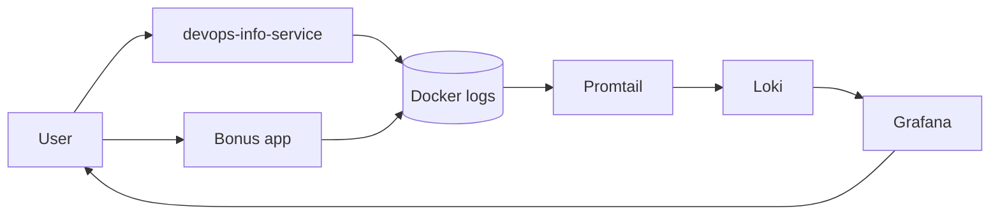

# Lab 7 — Loki Monitoring Stack

## Architecture



The Python applications run in Docker containers and write logs to stdout. Docker stores these logs under `/var/lib/docker/containers`. Promtail reads the container logs, enriches them with labels (for example `app` and `container`), and pushes log streams to Loki. Grafana connects to Loki as a data source and uses LogQL queries to display and aggregate logs in dashboards.

## LogQL Queries and Dashboard

For exploring logs in Grafana, I used the following base queries:

- Stream selection for the main application:

```logql
{app="devops-python"}
```

- Error messages only:

```logql
{app="devops-python"} |= "ERROR"
```

- Parsing JSON logs and filtering by method:

```logql
{app="devops-python"} | json | method="GET"
```

The Grafana dashboard contains four panels:

1. Table of logs from all applications:

```logql
{app=~"devops-.*"}
```

2. Graph of request rate by application:

```logql
sum by (app) (rate({app=~"devops-.*"}[1m]))
```

3. Separate panel for `ERROR` level logs:

```logql
{app=~"devops-.*"} | json | level="ERROR"
```

4. Distribution of logs by level over the last 5 minutes:

```logql
sum by (level) (count_over_time({app=~"devops-.*"} | json [5m]))
```

These queries are used in Explore and in the dashboard to quickly see the overall health of the services, request frequency, errors, and log level distribution.

**Dashboard — all 4 panels with real data:**


## Setup Guide

1. Go to the monitoring stack directory:

```bash
cd monitoring
```

2. Build the application image and start the stack:

```bash
docker compose up -d --build
docker compose ps
```

All services running and healthy:


3. Check Loki and Promtail availability:

```bash
curl http://localhost:3100/ready
curl http://localhost:9080/targets
```

Example response from Loki:

```text
ready
```

4. Open Grafana in the browser:

```bash
open http://localhost:3000
```

Login: username `admin`, password `admin123` (in a real environment this is set via `.env` and not committed to the repository).

5. Add the Loki data source:
   - Connections → Data sources → Add data source → Loki
   - URL: `http://loki:3100`
   - Save & Test (the expected message is "Data source connected").

6. Open Explore, select Loki as data source, run `{job="docker"}` — logs from all containers:


## Configuration

Fragment of the Loki config (`loki/config.yml`):

```yaml
auth_enabled: false

server:
  http_listen_port: 3100

common:
  path_prefix: /var/loki
  storage:
    filesystem:
      chunks_directory: /var/loki/chunks
  ring:
    kvstore:
      store: inmemory
  replication_factor: 1

schema_config:
  configs:
    - from: 2024-01-01
      store: tsdb
      object_store: filesystem
      schema: v13
      index:
        prefix: index_
        period: 24h
```

Loki runs in TSDB mode with local `filesystem` object storage. This provides faster queries and lower memory usage compared to older schemas. In `limits_config`, `retention_period: 168h` is set, and the `compactor` section enables deletion of expired logs. The `ruler.storage.local.directory` is set to `/var/loki/rules` to satisfy the required ruler-storage module initialization in Loki 3.0.

Fragment of the Promtail config (`promtail/config.yml`):

```yaml
scrape_configs:
  - job_name: docker
    docker_sd_configs:
      - host: unix:///var/run/docker.sock
        refresh_interval: 5s
        filters:
          - name: label
            values: ["logging=promtail"]
    relabel_configs:
      - source_labels: ["__meta_docker_container_name"]
        regex: "/(.*)"
        target_label: "container"
        replacement: "$1"
      - source_labels: ["__meta_docker_container_label_app"]
        target_label: "app"
      - source_labels: ["__meta_docker_container_label_logging"]
        target_label: "logging"
      - replacement: "docker"
        target_label: "job"
```

Promtail uses Docker service discovery with a `filters` directive to query only containers that have the `logging=promtail` Docker label — this filters at the Docker API level and prevents unlabeled containers from producing empty-label log streams. The container name is stored in the `container` label, and the `app` label is extracted from the Docker container label `app`.

## Application Logging

In `app_python/app.py`, a custom JSON formatter is configured:

```python
class JSONFormatter(logging.Formatter):
    def format(self, record: logging.LogRecord) -> str:
        log_record = {
            "timestamp": datetime.fromtimestamp(record.created, tz=timezone.utc).isoformat().replace("+00:00", "Z"),
            "level": record.levelname,
            "logger": record.name,
            "message": record.getMessage(),
        }
        extra_fields = getattr(record, "extra_fields", {})
        if isinstance(extra_fields, dict):
            log_record.update(extra_fields)
        return json.dumps(log_record, ensure_ascii=False)
```

Logs are written to stdout, so Docker and Promtail can see them. For requests to `/` and `/health`, the `extra_fields` include fields such as `event`, `method`, `path`, `client_ip`, `uptime_seconds`, and so on. Example of one log line:

```json
{"timestamp":"2026-03-12T18:05:31.123456Z","level":"INFO","logger":"devops-info-service","message":"Request received","event":"request","client_ip":"127.0.0.1","user_agent":"curl/8.6.0","method":"GET","path":"/"}
```

JSON log output from the container (`docker compose logs app-python`):


Thanks to the structured format, it is possible to use `| json` in LogQL and filter by individual fields (`method`, `event`, `level`, etc.).

Logs from the application parsed in Grafana Explore (`{app="devops-python"} | json`):


## Production Config

The `docker-compose.yml` file defines resource limits and health checks. Example for Loki:

```yaml
loki:
  user: "0"
  deploy:
    resources:
      limits:
        cpus: "1.0"
        memory: 1G
      reservations:
        cpus: "0.5"
        memory: 512M
  healthcheck:
    test: ["CMD-SHELL", "wget --no-verbose --tries=1 --spider http://localhost:3100/ready || exit 1"]
    interval: 15s
    timeout: 5s
    retries: 5
    start_period: 30s
```

Similar limits are set for Grafana, Promtail, and the application. Anonymous authorization is disabled in Grafana (`GF_AUTH_ANONYMOUS_ENABLED=false`), so access is allowed only by username and password. In production, these values should come from `.env` files or secrets, not be hardcoded in the Compose file.

Grafana login page (anonymous access disabled):


## Testing

The following commands were used to generate logs and verify the stack:

```bash
cd monitoring
docker compose up -d --build

# Check container status
docker compose ps

# Generate traffic
for i in {1..20}; do curl http://localhost:8000/; done
for i in {1..20}; do curl http://localhost:8000/health; done
```

Fragment of the output of `curl http://localhost:3100/ready`:

```text
ready
```

In Grafana, in the Explore section, the query:

```logql
{app="devops-python"} | json | event="request"
```

shows log lines with the `method`, `path`, and `client_ip` fields. For errors, for example, the following query is used:

```logql
{app="devops-python"} | json | level="ERROR"
```

## Challenges

Several problems came up during setup:

- At first, Promtail did not see the application containers because the `logging=promtail` label was missing. After adding labels to the `app-python` service, the logs appeared in Loki.
- In the Loki 3.0 configuration, `common.storage` requires the `filesystem` key, not `tsdb` — TSDB is a schema type set in `schema_config`, not a storage backend. Using `tsdb` inside `common.storage` caused a parse error.
- Loki 3.0 always initializes the `ruler-storage` module and requires `ruler.storage.local.directory` to be set even when the Ruler feature is not used. Adding the `ruler` section with a local directory resolved the startup failure.
- Promtail was sending batches with no labels, causing `400: at least one label pair is required per stream`. The root cause was that all 4 containers were discovered and some produced empty-label streams before `action: keep` filtered them. The fix was to move filtering to `filters` inside `docker_sd_configs`, which prevents unlabeled containers from being discovered at all.
- The Loki image does not include `curl`, so the healthcheck using `curl -f` always failed. Replacing it with `wget --no-verbose --tries=1 --spider` resolved the `(unhealthy)` status.
