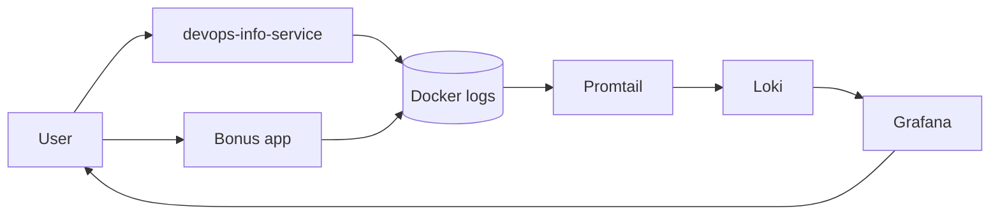

# Lab 7 — Loki Monitoring Stack

## Architecture



The Python applications run in Docker containers and write logs to stdout. Docker stores these logs under `/var/lib/docker/containers`. Promtail reads the container logs, enriches them with labels (for example `app` and `container`), and pushes log streams to Loki. Grafana connects to Loki as a data source and uses LogQL queries to display and aggregate logs in dashboards.

## LogQL Queries and Dashboard

For exploring logs in Grafana, I used the following base queries:

- Stream selection for the main application:

```logql
{app="devops-python"}
```

- Error messages only:

```logql
{app="devops-python"} |= "ERROR"
```

- Parsing JSON logs and filtering by method:

```logql
{app="devops-python"} | json | method="GET"
```

The Grafana dashboard contains four panels:

1. Table of logs from all applications:

```logql
{app=~"devops-.*"}
```

2. Graph of request rate by application:

```logql
sum by (app) (rate({app=~"devops-.*"}[1m]))
```

3. Separate panel for `ERROR` level logs:

```logql
{app=~"devops-.*"} | json | level="ERROR"
```

4. Distribution of logs by level over the last 5 minutes:

```logql
sum by (level) (count_over_time({app=~"devops-.*"} | json [5m]))
```

These queries are used in Explore and in the dashboard to quickly see the overall health of the services, request frequency, errors, and log level distribution.

## Setup Guide

1. Go to the monitoring stack directory:

```bash
cd monitoring
```

2. Build the application image and start the stack:

```bash
docker compose up -d --build
docker compose ps
```

Example output of `docker compose ps`:

```text
NAME                       COMMAND                  SERVICE      STATUS              PORTS
monitoring-loki-1          "/usr/bin/loki -con…"   loki         running (healthy)   0.0.0.0:3100->3100/tcp
monitoring-promtail-1      "/usr/bin/promtail …"   promtail     running             9080/tcp
monitoring-grafana-1       "/run.sh"               grafana      running (healthy)   0.0.0.0:3000->3000/tcp
monitoring-app-python-1    "python -m uvicorn…"   app-python   running             0.0.0.0:8000->5000/tcp
```

3. Check Loki and Promtail availability:

```bash
curl http://localhost:3100/ready
curl http://localhost:9080/targets
```

Example response from Loki:

```text
ready
```

4. Open Grafana in the browser:

```bash
open http://localhost:3000
```

Login: username `admin`, password `admin123` (in a real environment this is set via `.env` and not committed to the repository).

5. Add the Loki data source:
   - Connections → Data sources → Add data source → Loki
   - URL: `http://loki:3100`
   - Save & Test (the expected message is “Data source connected”).

## Configuration

Fragment of the Loki config (`loki/config.yml`):

```yaml
auth_enabled: false

server:
  http_listen_port: 3100

common:
  path_prefix: /var/loki
  storage:
    tsdb:
      dir: /var/loki/tsdb
```

Loki runs in TSDB mode with local `filesystem` object storage. This provides faster queries and lower memory usage compared to older schemas. In `limits_config`, `retention_period: 168h` is set, and the `compactor` section enables deletion of expired logs.

Fragment of the Promtail config (`promtail/config.yml`):

```yaml
scrape_configs:
  - job_name: docker
    docker_sd_configs:
      - host: unix:///var/run/docker.sock
        refresh_interval: 5s
    relabel_configs:
      - source_labels: ["__meta_docker_container_name"]
        target_label: "container"
        regex: "/(.*)"
        replacement: "$1"
      - source_labels: ["__meta_docker_container_label_logging"]
        target_label: "logging"
      - action: keep
        source_labels: ["__meta_docker_container_label_logging"]
        regex: "promtail"
```

Promtail uses Docker service discovery to automatically detect containers and filters only those that have the `logging=promtail` label. The container name is stored in the `container` label, which is convenient for further filtering in LogQL.

## Application Logging

In `app_python/app.py`, a custom JSON formatter is configured:

```python
class JSONFormatter(logging.Formatter):
    def format(self, record: logging.LogRecord) -> str:
        log_record = {
            "timestamp": datetime.fromtimestamp(record.created, tz=timezone.utc).isoformat().replace("+00:00", "Z"),
            "level": record.levelname,
            "logger": record.name,
            "message": record.getMessage(),
        }
        extra_fields = getattr(record, "extra_fields", {})
        if isinstance(extra_fields, dict):
            log_record.update(extra_fields)
        return json.dumps(log_record, ensure_ascii=False)
```

Logs are written to stdout, so Docker and Promtail can see them. For requests to `/` and `/health`, the `extra_fields` include fields such as `event`, `method`, `path`, `client_ip`, `uptime_seconds`, and so on. Example of one log line:

```json
{"timestamp":"2026-03-12T18:05:31.123456Z","level":"INFO","logger":"devops-info-service","message":"Request received","event":"request","client_ip":"127.0.0.1","user_agent":"curl/8.6.0","method":"GET","path":"/"}
```

Thanks to the structured format, it is possible to use `| json` in LogQL and filter by individual fields (`method`, `event`, `level`, etc.).

## Production Config

The `docker-compose.yml` file defines resource limits and health checks. Example for Loki:

```yaml
loki:
  deploy:
    resources:
      limits:
        cpus: "1.0"
        memory: 1G
      reservations:
        cpus: "0.5"
        memory: 512M
  healthcheck:
    test: ["CMD-SHELL", "curl -f http://localhost:3100/ready || exit 1"]
    interval: 10s
    timeout: 5s
    retries: 5
    start_period: 10s
```

Similar limits are set for Grafana, Promtail, and the application. Anonymous authorization is disabled in Grafana (`GF_AUTH_ANONYMOUS_ENABLED=false`), so access is allowed only by username and password. In production, these values should come from `.env` files or secrets, not be hardcoded in the Compose file.

## Testing

The following commands were used to generate logs and verify the stack:

```bash
cd monitoring
docker compose up -d --build

# Check container status
docker compose ps

# Generate traffic
for i in {1..20}; do curl http://localhost:8000/; done
for i in {1..20}; do curl http://localhost:8000/health; done
```

Fragment of the output of `curl http://localhost:3100/ready`:

```text
ready
```

In Grafana, in the Explore section, the query:

```logql
{app="devops-python"} | json | event="request"
```

shows log lines with the `method`, `path`, and `client_ip` fields. For errors, for example, the following query is used:

```logql
{app="devops-python"} | json | level="ERROR"
```

## Challenges

Several problems came up during setup:

- At first, Promtail did not see the application containers because the `logging=promtail` label was missing. After adding labels to the `app-python` service, the logs appeared in Loki.
- In the Loki configuration, consistency between `schema_config` and `storage_config` is important. An incorrect `schema` caused a startup error, so schema `v13` with TSDB storage and `filesystem` was chosen.
- During the first Grafana launch, anonymous authorization was enabled, which is convenient for debugging but insecure. In the production part of the Compose file, anonymous access is disabled, and login is done through an administrator account.
