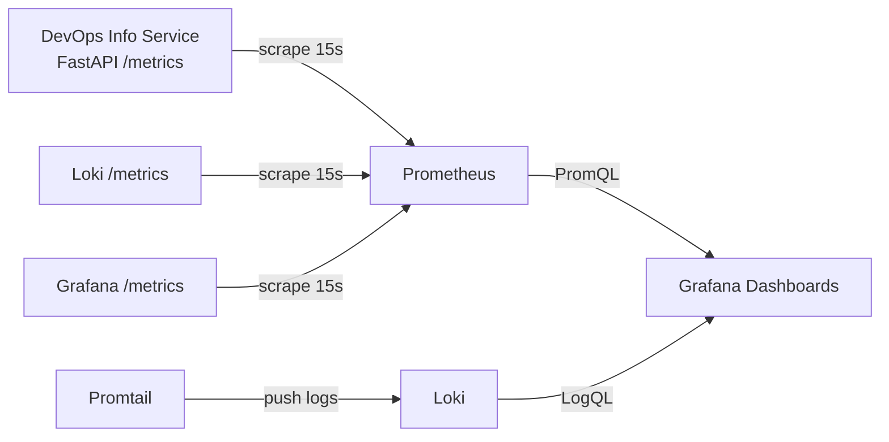
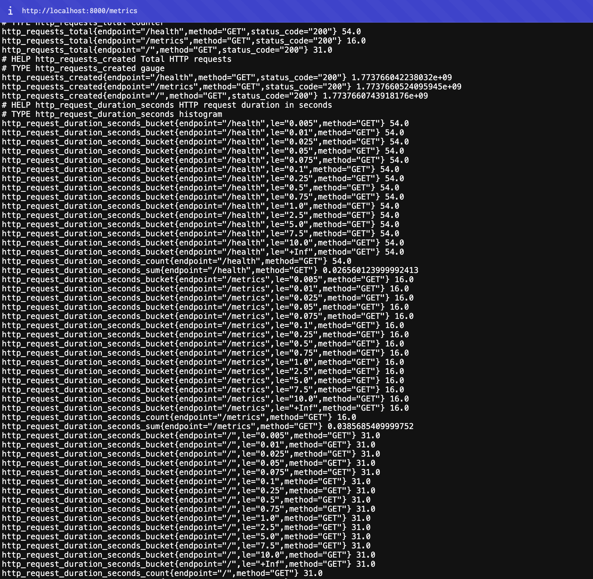
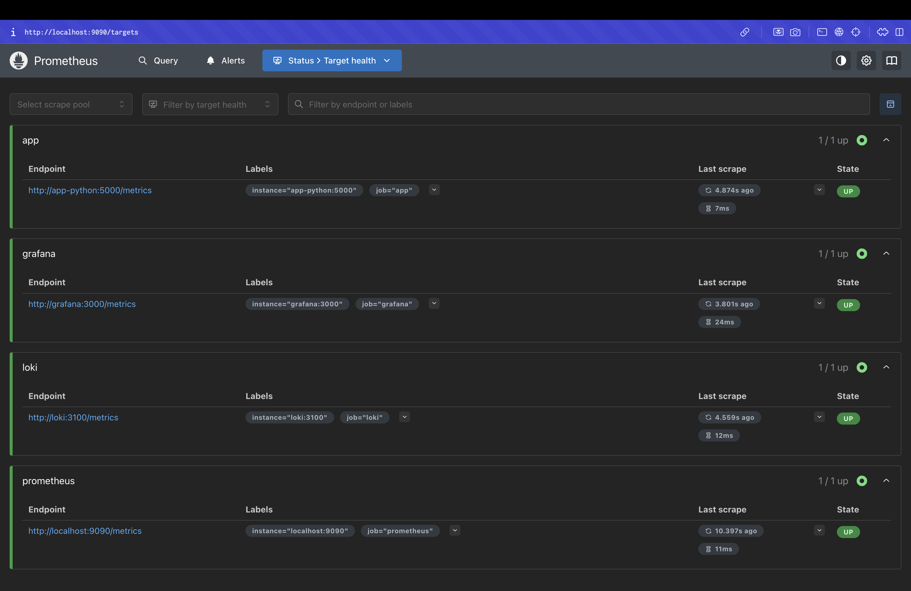
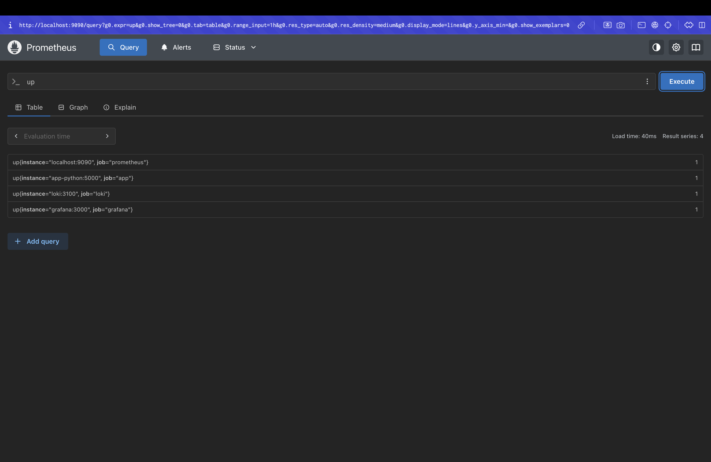
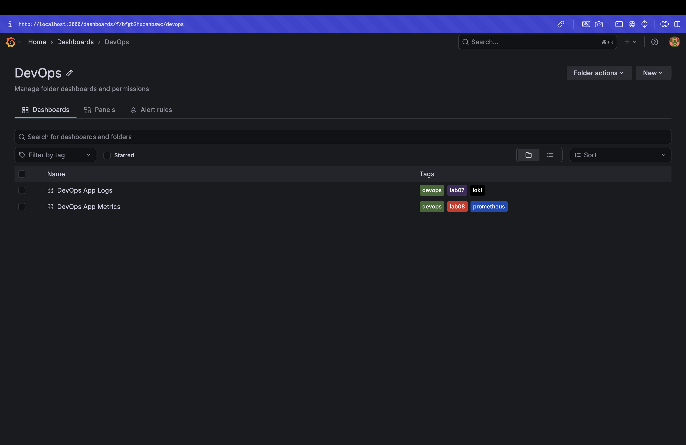
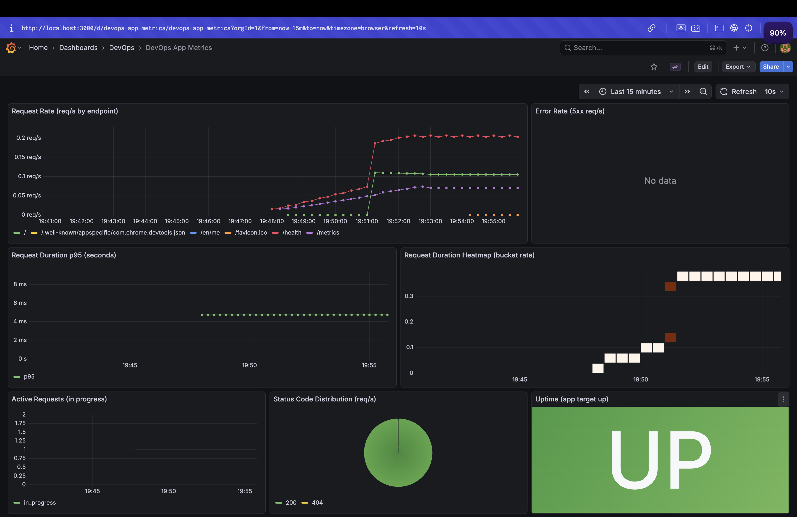

# LAB08 — Metrics & Monitoring with Prometheus

## Architecture

## Application Instrumentation

### Metrics added

- **RED (HTTP)**
  - **Counter** `http_requests_total{method,endpoint,status_code}`: total HTTP requests.
  - **Histogram** `http_request_duration_seconds{method,endpoint}`: request latency distribution.
  - **Gauge** `http_requests_in_progress`: number of in-flight requests.
- **App-specific**
  - **Counter** `devops_info_endpoint_calls{endpoint}`: per-endpoint usage (excluding `/metrics`).
  - **Histogram** `devops_info_system_collection_seconds`: time spent collecting system info.

### Where it’s implemented

- FastAPI middleware instruments every request and exposes `/metrics` endpoint.

## Prometheus Configuration

- **Scrape interval**: 15s
- **Targets/jobs**
  - `prometheus`: `localhost:9090`
  - `app`: `app-python:5000` (path `/metrics`)
  - `loki`: `loki:3100`
  - `grafana`: `grafana:3000`
- **Retention**
  - `--storage.tsdb.retention.time=15d`
  - `--storage.tsdb.retention.size=10GB`

Config file: `monitoring/prometheus/prometheus.yml`

## Grafana Dashboards

### Provisioned data sources

- **Prometheus**: `http://prometheus:9090` (default)
- **Loki**: `http://loki:3100`

### Provisioned dashboards (folder “DevOps”)

1. **DevOps App Logs** (Lab 7) — `devops-app-logs`
2. **DevOps App Metrics** (Lab 8) — `devops-app-metrics`

### DevOps App Metrics panels and queries

1. **Request Rate (req/s by endpoint)**
   - `sum(rate(http_requests_total[5m])) by (endpoint)`
2. **Error Rate (5xx req/s)**
   - `sum(rate(http_requests_total{status_code=~"5.."}[5m]))`
3. **Request Duration p95 (seconds)**
   - `histogram_quantile(0.95, sum by (le) (rate(http_request_duration_seconds_bucket[5m])))`
4. **Request Duration Heatmap**
   - `sum by (le) (rate(http_request_duration_seconds_bucket[5m]))`
5. **Active Requests**
   - `http_requests_in_progress`
6. **Status Code Distribution**
   - `sum by (status_code) (rate(http_requests_total[5m]))`
7. **Uptime**
   - `up{job="app"}`

## PromQL Examples (5+)

1. **All targets UP/DOWN**
   - `up`
2. **Total req/s**
   - `sum(rate(http_requests_total[5m]))`
3. **Req/s by endpoint**
   - `sum by (endpoint) (rate(http_requests_total[5m]))`
4. **5xx error req/s**
   - `sum(rate(http_requests_total{status_code=~"5.."}[5m]))`
5. **p95 latency**
   - `histogram_quantile(0.95, sum by (le) (rate(http_request_duration_seconds_bucket[5m])))`
6. **Top endpoints by traffic**
   - `topk(5, sum by (endpoint) (rate(http_requests_total[5m])))`

## Production Setup

- **Health checks**: added for Grafana, Loki, Prometheus, app.
- **Resource limits**: set in `docker-compose.yml` per service.
- **Persistence**
  - `prometheus-data`, `loki-data`, `grafana-data` volumes.

## Testing Results (what to screenshot)

- `/metrics` output from app.
- Prometheus `/targets` showing all jobs **UP**.
- Grafana dashboards (both logs + metrics) with live data.

### Screenshots

1. **App metrics endpoint** (`/metrics`)

2. **Prometheus targets** (all jobs UP)

3. **PromQL example** (`up` query result)

4. **Grafana provisioning proof** (dashboards already exist)

5. **Grafana metrics dashboard** (6+ panels with live data)

## Challenges & Solutions

- App runs on container port `5000`, host maps `8000:5000`, so Prometheus scrapes `app-python:5000` inside the Docker network.

